# Cardinator

**Make custom Magic-style cards.** Look up a real card on **Scryfall** to auto-fill its name, mana
cost, type, rules text and power/toughness — then drop in your **own art**, pick a frame, and export
a print-quality **PNG**. Every field is editable, so you can make completely original cards too.

- 🖼️ **Your art, real layout** — artwork fills the card, with the frame, mana symbols and text
  composited cleanly over the top. Or go **full-art**: text directly on the artwork.
- 🌐 **Real art from the internet** — looking a card up on Scryfall also pulls its actual artwork,
  so you get a finished card in one click (swap in your own art any time). Import a whole
  **Scryfall search** (e.g. `t:dragon`) to build a themed set fast.
- 🎨 **Custom frames** — bring your own frame PNG (file or URL) and Cardinator turns it into a
  template; tune fonts (size/color/shadow) and regions to match.
- 📦 **No install, no runtime** — ships as a single self-contained `Cardinator.exe` (Windows 10/11).
- 🗂️ **One card or a hundred** — build a project, import a CSV, batch-export, print 3×3 sheets,
  export PNG/JPEG with print **bleed & DPI**, and a matching **card back** for double-sided printing.
- 🔌 **Works offline** — frames, mana symbols and sample cards are generated locally; the internet
  is only used for Scryfall lookups and downloading art.

---

## The app

Simple by design: type a name, pick a frame, drop in art, export. Everything else is one click away.

<p>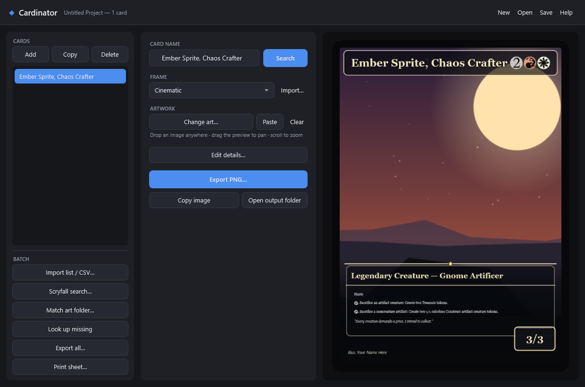</p>

---

## Gallery

Real Cardinator output — a normal creature plus the special layouts it lays out for you
automatically (planeswalker, saga, adventure, artifact), each on a different built-in frame:

<p>
  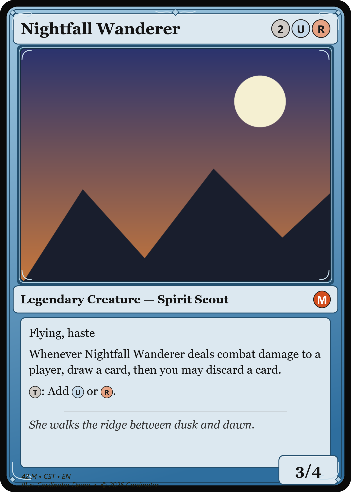
  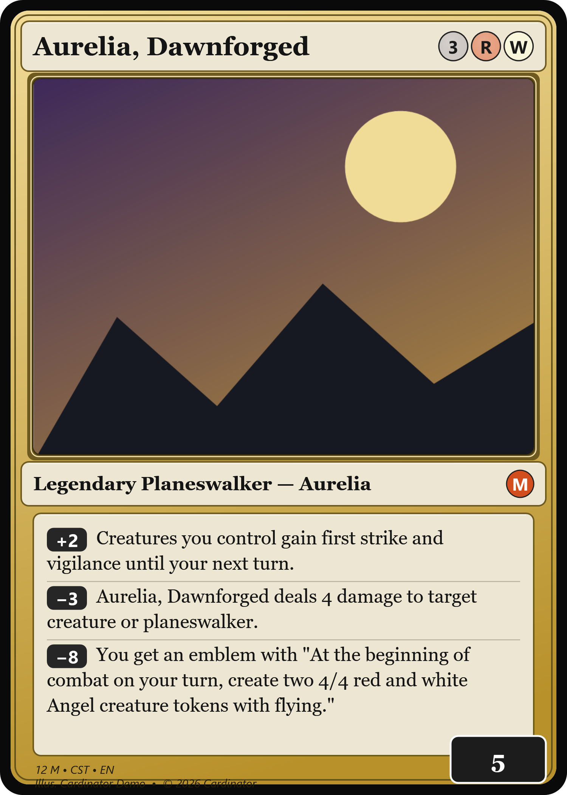
  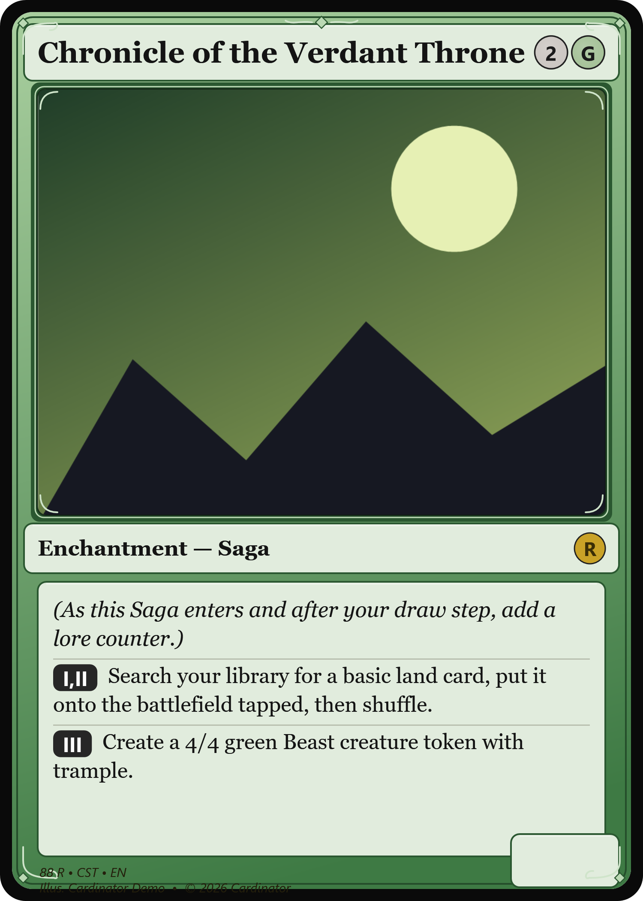
</p>
<p>
  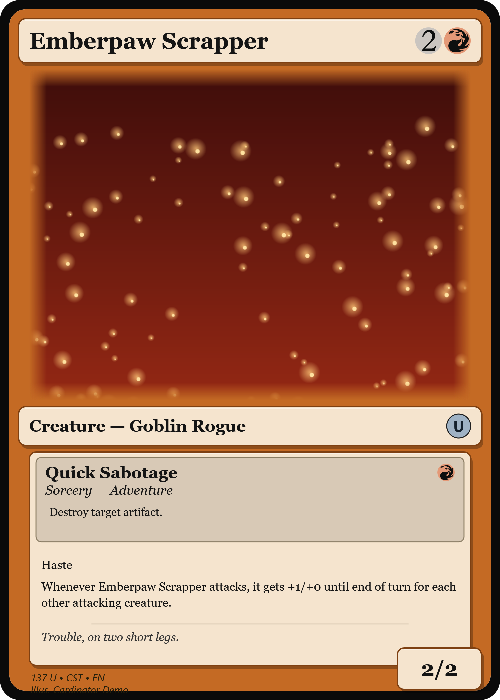
  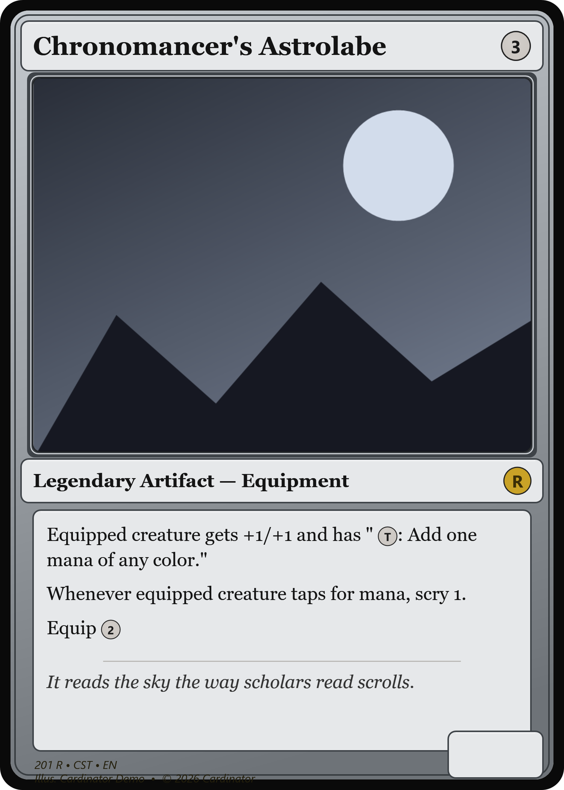
  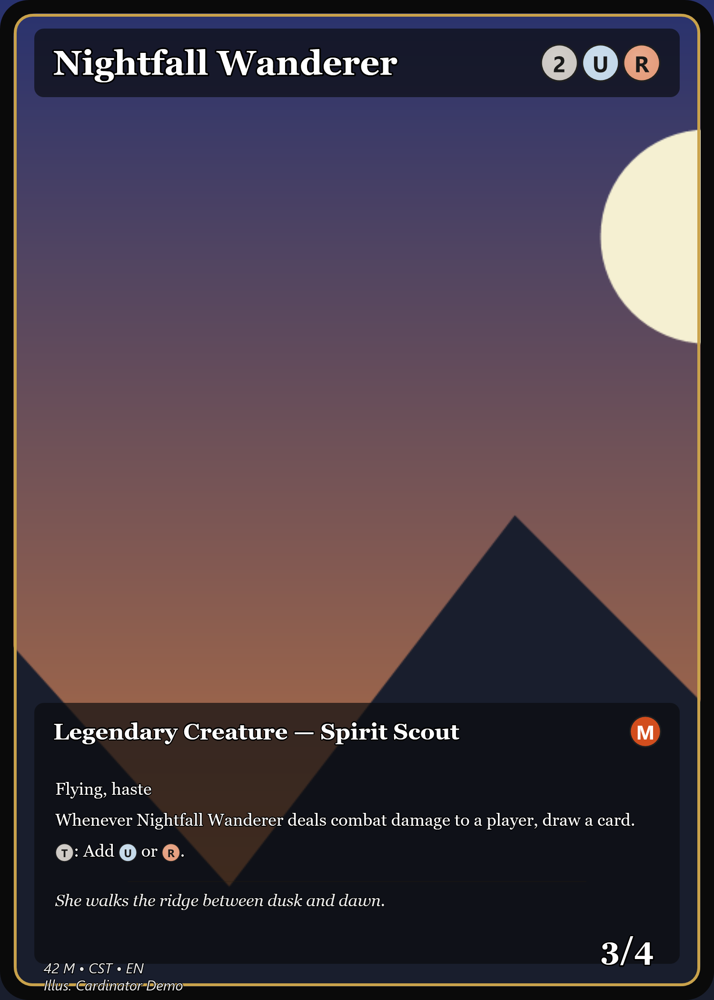
</p>

*(Everything shown is drawn by Cardinator — frames, the generic mana pips, loyalty badges, saga
chapters, the adventure sub-box, rarity pip and footer. The last card is **full-art** (text
directly on the artwork). All cards use invented names/text and placeholder scenery; when you look
a real card up in the app, Cardinator fetches its authentic mana symbols and art from Scryfall.)*

---

## Get it running

### The easy way (finished exe)
1. Copy `Cardinator.exe` anywhere (e.g. a Desktop folder) and double-click it.
2. On first run it creates a **`CardinatorData`** folder next to the exe (templates, mana symbols,
   saved projects, exported PNGs). Move the exe + that folder together to take everything with you.

### From source
Requires the **.NET 8 SDK** (Windows).

```powershell
dotnet run --project src/Cardinator          # run the app

dotnet publish src/Cardinator/Cardinator.csproj -c Release -r win-x64 `
  --self-contained true -p:PublishSingleFile=true -o publish   # -> publish/Cardinator.exe
```

---

## Quick start

1. **Type a card name** and click **Search** (or **Ctrl+L**) to auto-fill from Scryfall — or type
   the fields yourself for an original card.
2. **Pick a frame** from the dropdown.
3. **Add art** — **Change art…**, **Paste** (image / file / URL), or **drag an image onto the
   window**. Drag the preview to pan, scroll to zoom.
4. **Edit details…** to tweak any field (rules, flavor, rarity, artist…).
5. **Export PNG…** (1500×2100) or **Copy image** to the clipboard.

Full walkthrough → **[User Guide](docs/USER_GUIDE.md)**.

---

## Make many at once

Cardinator works on a **project** (the list on the left). Import a whole batch, fill blanks from
Scryfall, and export everything:

- **Import list / CSV…** — a list of names, `Name | art.png` lines, or a CSV/TSV with a header row
  (columns matched by friendly names in any order). See the [example CSV](examples/cards.csv).
- **Match art folder…** — attach a folder of images to cards by filename.
- **Look up missing** — fetch any card that still has only a name.
- **Export all…** — render every card to PNGs (background progress bar).
- **Print sheet…** — 9 cards per page (3×3, real size, 300 DPI, cut marks), Letter or A4.
- **Save / Open** — the whole project is one `.cardinator` file.

Details → **[User Guide: making many cards](docs/USER_GUIDE.md#4-making-many-cards-at-once)**.

---

## Browse the examples

Every example is a ready-to-run folder — **inputs, our own art, the exact command, and the rendered
output are all checked in.** Click a thumbnail for that example's guide.

<table>
<tr>
<td align="center" width="25%"><a href="examples/01-custom-set/">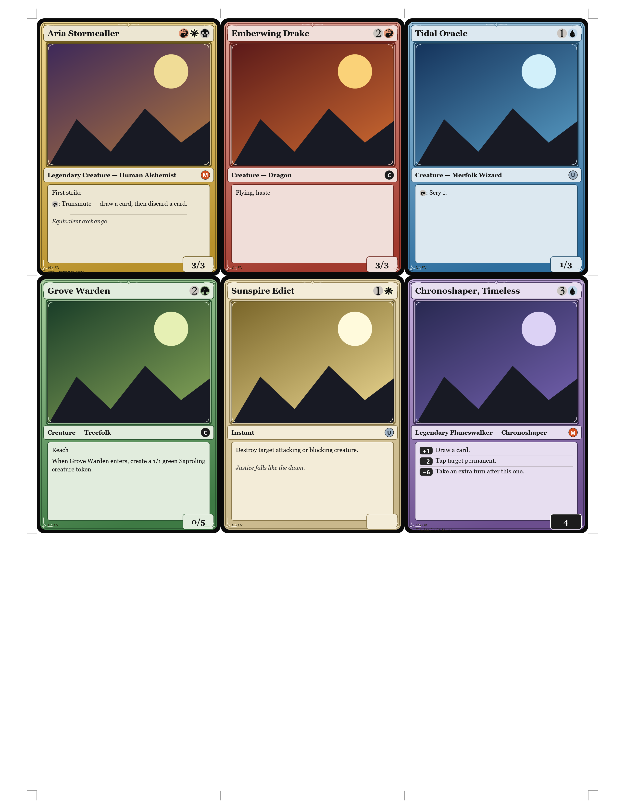</a><br/><a href="examples/01-custom-set/"><b>Custom set</b></a><br/><sub>your own cards from a CSV</sub></td>
<td align="center" width="25%"><a href="examples/02-proxy-deck/">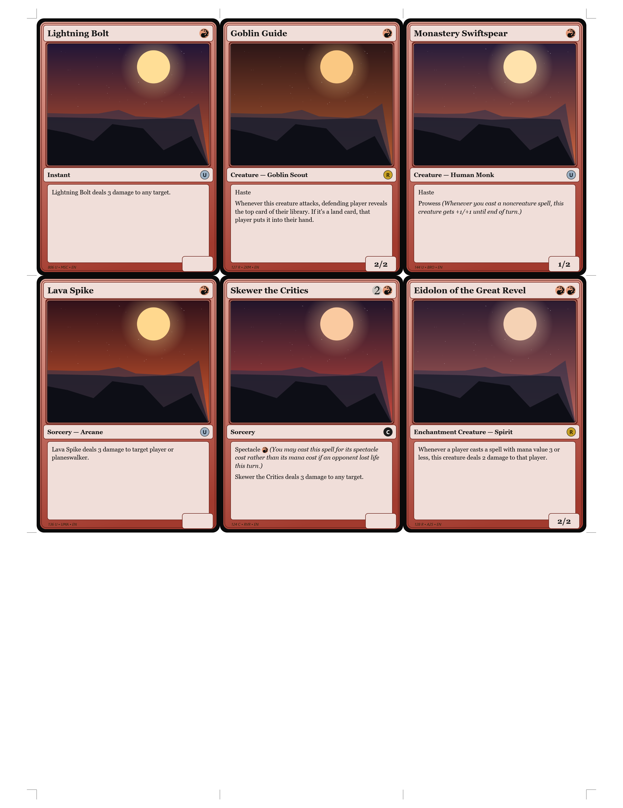</a><br/><a href="examples/02-proxy-deck/"><b>Real cards, custom art ⭐</b></a><br/><sub>a whole deck in your art</sub></td>
<td align="center" width="25%"><a href="examples/03-full-art/">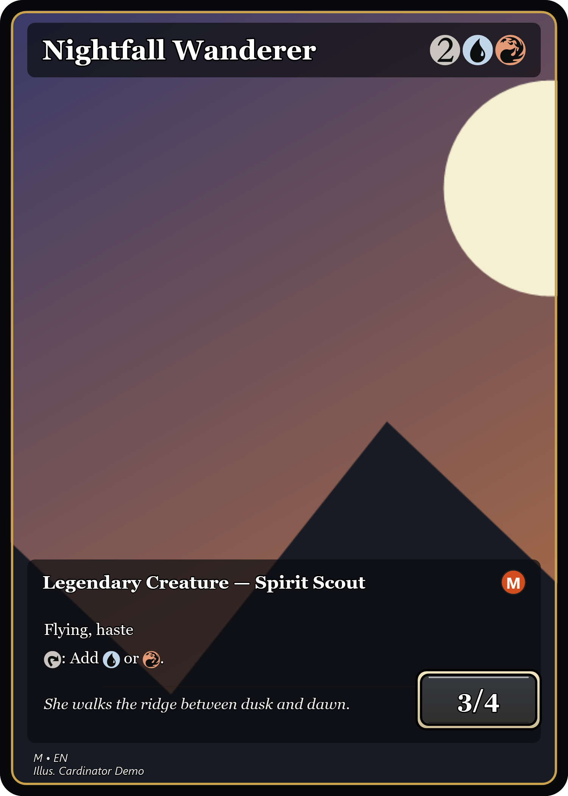</a><br/><a href="examples/03-full-art/"><b>Full-art</b></a><br/><sub>text on the artwork</sub></td>
<td align="center" width="25%"><a href="examples/04-custom-frame/">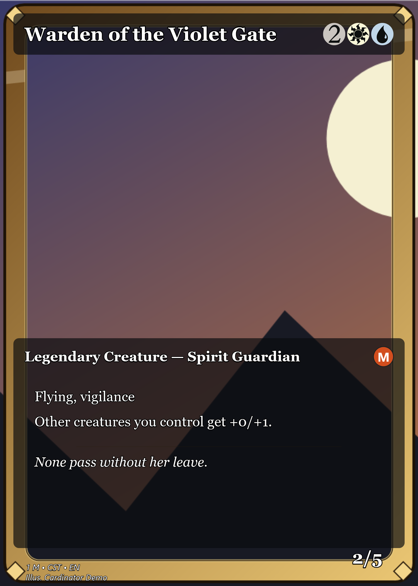</a><br/><a href="examples/04-custom-frame/"><b>Custom frame</b></a><br/><sub>bring your own frame PNG</sub></td>
</tr>
<tr>
<td align="center" width="25%"><a href="examples/05-print-and-play/">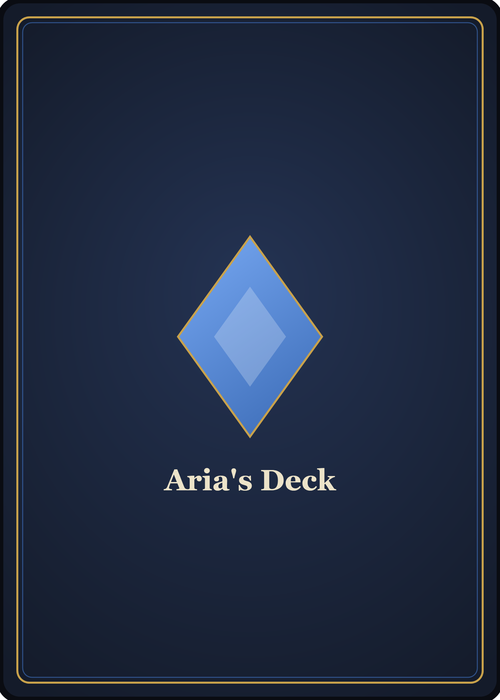</a><br/><a href="examples/05-print-and-play/"><b>Print &amp; play</b></a><br/><sub>a matching card back</sub></td>
<td align="center" width="25%"><a href="examples/06-print-ready/">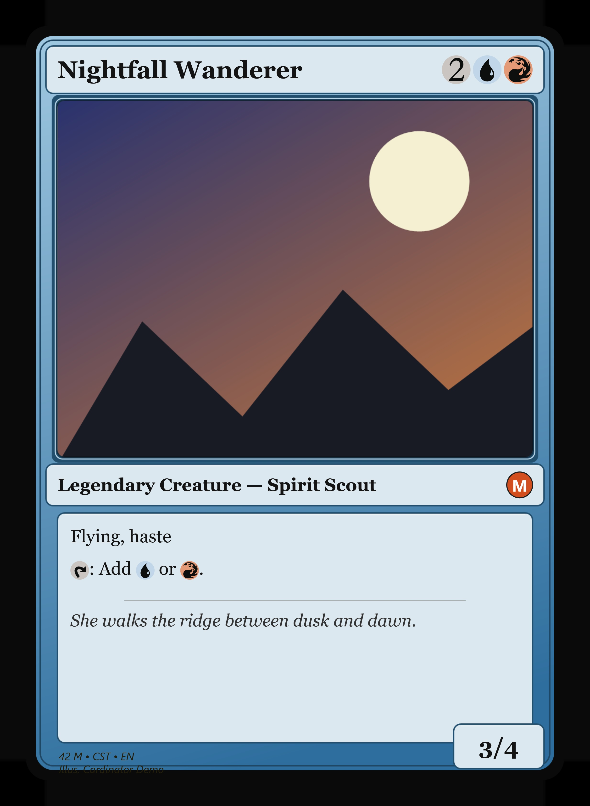</a><br/><a href="examples/06-print-ready/"><b>Print-ready</b></a><br/><sub>bleed + 300 DPI for print shops</sub></td>
<td align="center" width="25%"><a href="examples/07-tokens-emblems/">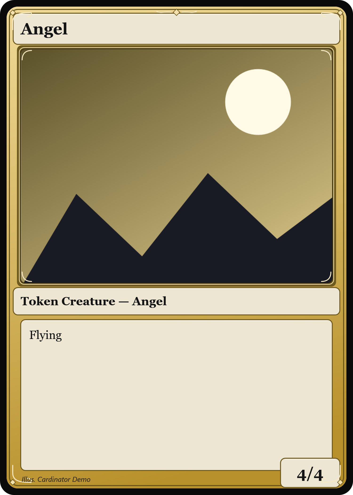</a><br/><a href="examples/07-tokens-emblems/"><b>Tokens &amp; emblems</b></a><br/><sub>the deck's extras</sub></td>
<td align="center" width="25%"><a href="examples/"><br/><b>All examples →</b><br/><sub>+ a Scryfall-search set</sub></a></td>
</tr>
</table>

---

## Documentation

| Doc | What's in it |
|-----|--------------|
| **[User Guide](docs/USER_GUIDE.md)** | Step-by-step for making cards, mana/rules syntax, special types, shortcuts, troubleshooting |
| **[Making your own frames](docs/TEMPLATES.md)** | The `template.json` format and how to add/share templates |
| **[Command-line reference](docs/CLI.md)** | Headless modes for scripting/batch/verification |
| **[Developing](docs/DEVELOPING.md)** | Build, test, architecture, and how rendering works |
| **[Examples](examples/README.md)** | Ready-to-run worked examples — custom set, real-deck proxies, full-art, custom frame — with inputs **and** outputs checked in |

---

## What it supports

- **Card types:** creatures, spells, **planeswalkers** (loyalty box + ability badges), **sagas**
  (chapter markers), **classes** (level badges), **adventures** (spell sub-box), and
  **double-faced cards** (imported as front + back). Split cards import as two cards.
- **Mana:** `{2}{R}{W}`, `{X}`, `{T}`, `{C}`, hybrids `{R/W}`, Phyrexian `{U/P}` — inline in rules
  text too. Loose input like `2RW` is normalized automatically.
- **Symbols:** authentic Scryfall SVG art, cached locally after first use; clean drawn pips as an
  offline fallback.

## Keyboard shortcuts

**F1** built-in help · **Ctrl+N/O/S** new/open/save · **Ctrl+L** look up · **Ctrl+E** export ·
**Ctrl+D** duplicate. The title shows **●** for unsaved changes; Cardinator asks before you lose
work. There's also a **Help** button in the top-right for the in-app cheat sheet.

---

## Notes & limitations

- Frames are a generated MTG-*style* look, not pixel-perfect reproductions of official frames (you
  can drop in your own `frame.png` — see [TEMPLATES.md](docs/TEMPLATES.md)).
- Custom art and card names are your responsibility — this tool is for personal/custom cards.

## Development

`dotnet test` runs the suite (**137 tests**). The renderer is verified headlessly via
`Cardinator.exe --selftest` / `--render`, so changes can be checked without opening the GUI. See
**[Developing](docs/DEVELOPING.md)**.

## Contributing

This is a personal tool, published as-is — issues and pull requests aren't accepted (PRs
auto-close). Fork it and make it your own.

## Legal / fan content

Cardinator is a fan-made tool and is **not affiliated with, endorsed, or sponsored by Wizards of
the Coast.** "Magic: The Gathering," the mana symbols, and card names / rules text / artwork are
© Wizards of the Coast and the respective artists. Cardinator ships **none** of that — the frames
and card back are drawn by the app, and mana symbols, card data and art are fetched at runtime from
the [Scryfall API](https://scryfall.com/docs/api) (used per their guidelines). It's meant for
**personal / fan use** under Wizards' Fan Content Policy: don't sell what you make, and you're
responsible for any art you import.

## License

MIT — see [LICENSE](LICENSE). © 2026 RelentlessOldMan.

<sub>◆ Cardinator — one of a few personal tools I felt like sharing.</sub>
