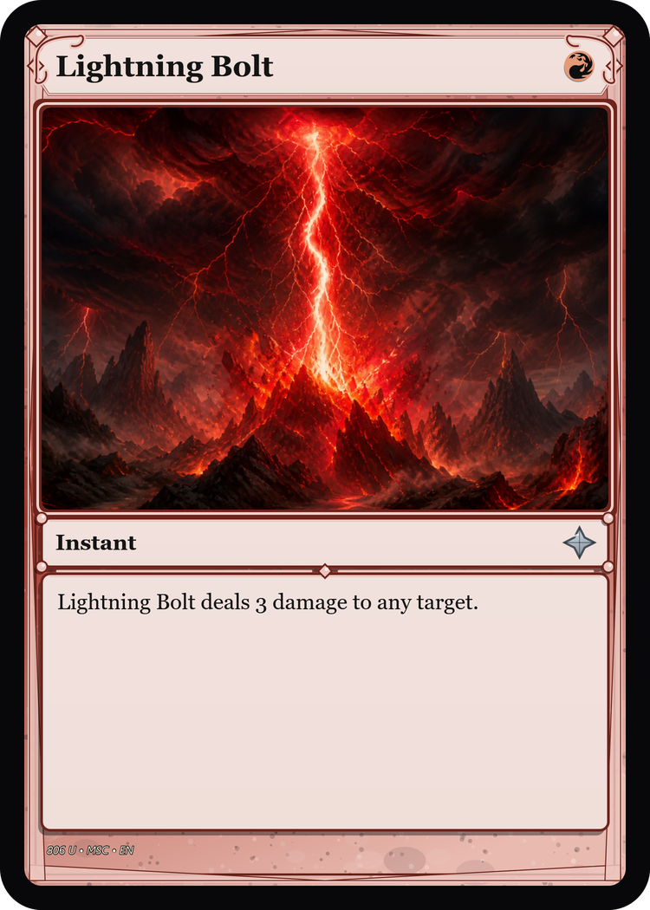
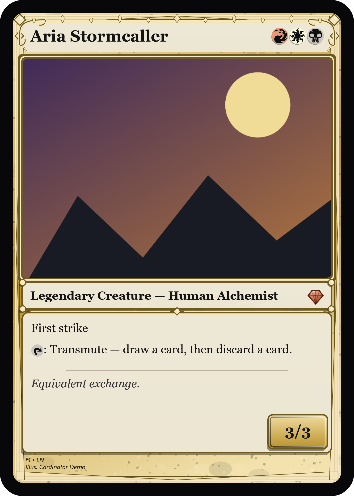
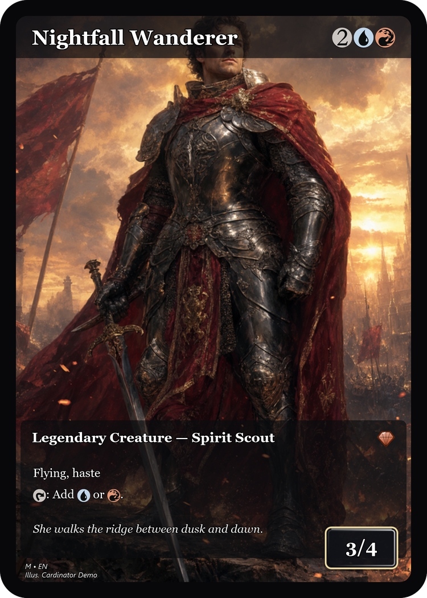
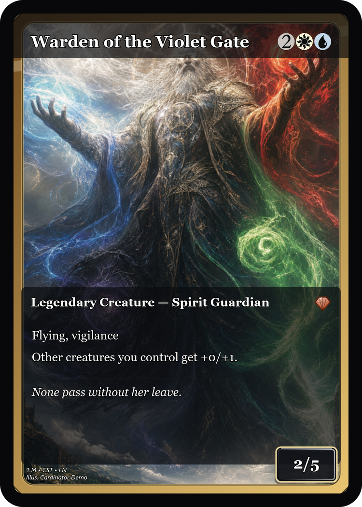
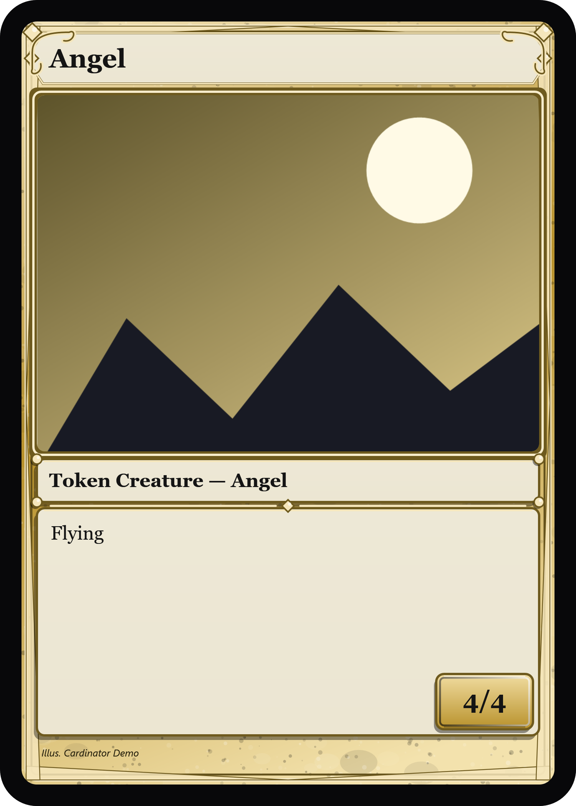
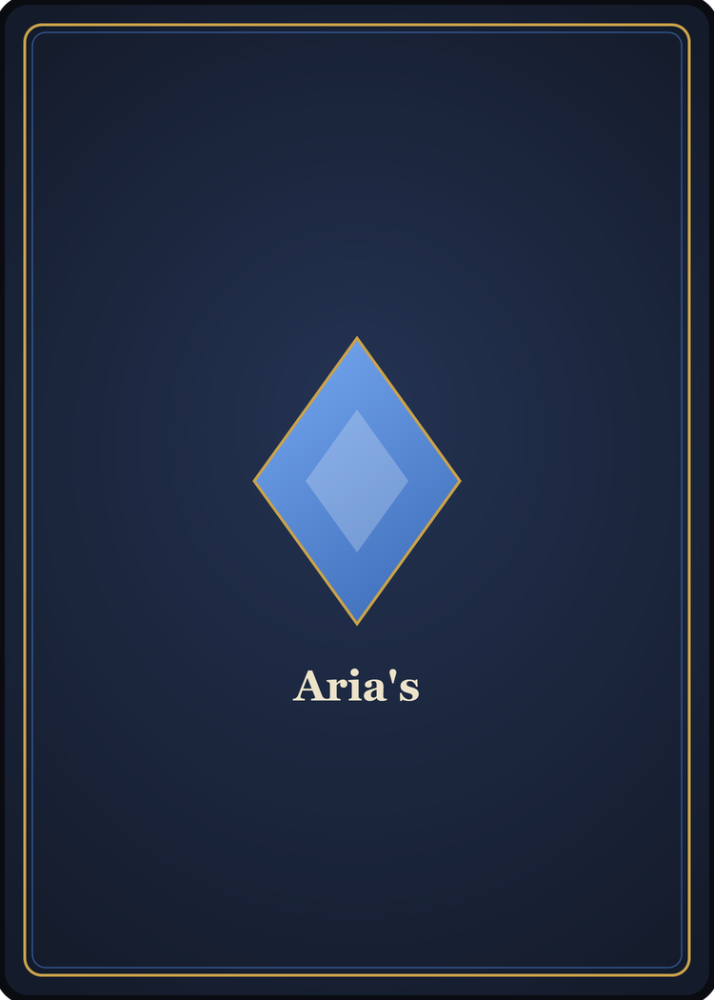

# Cardinator

**Make custom Magic-style cards.** Look up a real card on **Scryfall** to auto-fill its name, mana
cost, type, rules text and power/toughness — then drop in your **own art**, pick a frame, and export
a print-quality **PNG**. Every field is editable, so you can make completely original cards too.

- 🖼️ **Your art, real layout** — artwork fills the card, with the frame, mana symbols and text
  composited cleanly over the top. Or go **full-art**: text directly on the artwork.
- 🌐 **Real art from the internet** — looking a card up on Scryfall also pulls its actual artwork,
  so you get a finished card in one click (swap in your own art any time). Import a whole
  **Scryfall search** (e.g. `t:dragon`) to build a themed set fast.
- 🎨 **Custom frames** — bring your own frame PNG (file or URL) and Cardinator turns it into a
  template; tune fonts (size/color/shadow) and regions to match.
- 📦 **No install, no runtime** — ships as a single self-contained `Cardinator.exe` (Windows 10/11).
- 🗂️ **One card or a hundred** — build a project, import a CSV, batch-export, print 3×3 sheets,
  export PNG/JPEG with print **bleed & DPI**, and a matching **card back** for double-sided printing.
- 🔌 **Works offline** — frames, mana symbols and sample cards are generated locally; the internet
  is only used for Scryfall lookups and downloading art.

---

## The app

Simple by design: type a name, pick a frame, drop in art, export. Everything else is one click away.

<p></p>

---

## Gallery

Cardinator draws cards across a range of frame **styles** — ornate, clean, classic, faded,
borderless, full-art, the cinematic **overlay** (full-bleed art with the text over the bottom), and
the flowing **wave** crown. Every part — frames, mana symbols, loyalty badges, saga chapters, the
adventure storybook pages, rarity pips, the P/T box and footer — is drawn by the app.

### **[→ See the full gallery: 13 cards across the classic frame styles](docs/GALLERY.md)**

### Every kind of card

Not just creatures and spells: the special layouts are drawn too, on every frame, including your own.

<table>
<tr>
<td align="center"><br><b>Split</b><br><sub>a frame per half, Fuse bar</sub></td>
<td align="center"><br><b>Aftermath</b></td>
<td align="center"><br><b>Flip</b></td>
<td align="center"><br><b>Adventure</b></td>
</tr>
<tr>
<td align="center"><br><b>Level up</b></td>
<td align="center"><br><b>Prototype / Mutate</b></td>
<td align="center" colspan="2"><br><b>Meld</b></td>
</tr>
<tr>
<td align="center" colspan="2"><br><b>Station &amp; Case</b></td>
<td align="center" colspan="2"><br><b>Battles &amp; Planes</b><br><sub>drawn sideways</sub></td>
</tr>
<tr>
<td align="center" colspan="4"><br><b>Tokens &amp; emblems</b><br><sub>tall art, a text box only if it has rules — make your set's tokens and print them with it</sub></td>
</tr>
</table>

Plus planeswalkers, sagas, classes and double-faced cards. **[How to make each one →](docs/USER_GUIDE.md#special-card-types)**

**18 built-in frames:** 15 drawn styles (Gold, Crimson, Ocean, Forest, Slate, Midnight, Parchment,
Sunset, Planeswalker, Full Art, Showcase, Cinematic, plus the **Tidecaller** wave, **Azure Modern**
M15-style and **Ironwrought Showcase** composable), and 3 image-based **alchemy sample frames** (the
*Partial Cardboard Chemist* set — riveted steel, aged parchment, carved stone). All tweakable.
**[See them all →](docs/TEMPLATES.md#the-built-in-frames)**

---

## Get it running

### The easy way (finished exe)
1. **[⬇ Download the latest `Cardinator.exe`](https://github.com/RelentlessOldMan/Cardinator/releases/latest)**
   from the Releases page. It's a single self-contained file — no install, no .NET runtime needed.
2. Copy it anywhere (e.g. a Desktop folder) and double-click it.
3. On first run it creates a **`CardinatorData`** folder next to the exe (templates, mana symbols,
   saved projects, exported PNGs). Move the exe + that folder together to take everything with you.

> **First-run Windows warning:** because the exe isn't code-signed, Windows SmartScreen may show
> *"Windows protected your PC."* Click **More info → Run anyway** — nothing is being installed. (To
> avoid it entirely, right-click `Cardinator.exe` → **Properties** → tick **Unblock** → **OK** before
> launching.) This is the normal warning for any new, unsigned app.

### From source
Requires the **.NET 8 SDK** (Windows).

```powershell
dotnet run --project src/Cardinator          # run the app

dotnet publish src/Cardinator/Cardinator.csproj -c Release -r win-x64 `
  --self-contained true -p:PublishSingleFile=true -o publish   # -> publish/Cardinator.exe
```

---

## Quick start

1. **Type a card name** and click **Search** (or **Ctrl+L**) to auto-fill from Scryfall — or type
   the fields yourself for an original card.
2. **Pick a frame** from the dropdown.
3. **Add art** — **Change art…**, **Paste** (image / file / URL), or **drag an image onto the
   window**. Drag the preview to pan, scroll to zoom.
4. **Edit details…** to tweak any field (rules, flavor, rarity, artist…).
5. **Export PNG…** (1500×2100) or **Copy image** to the clipboard.

Full walkthrough → **[User Guide](docs/USER_GUIDE.md)**.

---

## Make many at once

Cardinator works on a **project** (the list on the left). **Import file…** loads a batch — a
list of names, `Name | art.png` lines, or a CSV/TSV with a header row (see the
[example deck](examples/01-real-cards-custom-art/deck.csv)) — or import a whole **Scryfall search**.
Then **Fill blanks from Scryfall** fills what's missing, **Add art from folder…** attaches art by filename,
**Set fields on all…** bulk-edits set/artist/rarity/frame, and **Export all…** / **Print sheet…**
render everything (3×3 pages at real size + optional card backs). A live **CHECKS** panel flags
problems as you type, and every edit is undoable.

Full list of batch tools → **[User Guide: making many cards](docs/USER_GUIDE.md#4-making-many-cards-at-once)**.

---

## Browse the examples

Every example is a ready-to-run folder — **inputs, our own art, the exact command, and the rendered
output are all checked in.** Click a thumbnail for that example's guide.

<table>
<tr>
<td align="center" width="33%"><a href="examples/01-real-cards-custom-art/"></a><br/><a href="examples/01-real-cards-custom-art/"><b>⭐ Real cards</b></a><br/><sub>a whole deck in your art</sub></td>
<td align="center" width="33%"><a href="examples/02-custom-set/"></a><br/><a href="examples/02-custom-set/"><b>Custom set</b></a><br/><sub>your own cards from a CSV</sub></td>
<td align="center" width="33%"><a href="examples/03-full-art/"></a><br/><a href="examples/03-full-art/"><b>Full-art</b></a><br/><sub>text on the artwork</sub></td>
</tr>
<tr>
<td align="center" width="33%"><a href="examples/04-custom-frame/"></a><br/><a href="examples/04-custom-frame/"><b>Custom frame</b></a><br/><sub>bring your own frame PNG</sub></td>
<td align="center" width="33%"><a href="examples/05-tokens-emblems/"></a><br/><a href="examples/05-tokens-emblems/"><b>Tokens</b></a><br/><sub>the deck's extras</sub></td>
<td align="center" width="33%"><a href="examples/06-printing/"></a><br/><a href="examples/06-printing/"><b>Printing</b></a><br/><sub>card back + bleed export</sub></td>
</tr>
</table>

<p align="center"><b><a href="examples/">All examples →</a></b> · or generate a whole set from a <code>--search</code></p>

---

## Documentation

| Doc | What's in it |
|-----|--------------|
| **[Quick Start](docs/QUICKSTART.md)** | Illustrated one-page walkthrough (auto-generated by `--docs`) |
| **[User Guide](docs/USER_GUIDE.md)** | Step-by-step for making cards, mana/rules syntax, special types, shortcuts, troubleshooting |
| **[Making your own frames](docs/TEMPLATES.md)** | The `template.json` format and how to add/share templates |
| **[Command-line reference](docs/CLI.md)** | Headless modes for scripting/batch/verification |
| **[Developing](docs/DEVELOPING.md)** | Build, test, architecture, and how rendering works |
| **[Examples](examples/README.md)** | Ready-to-run worked examples — custom set, real-deck proxies, full-art, custom frame — with inputs **and** outputs checked in |

---

## What it supports

- **Card types:** creatures, spells, **planeswalkers** (loyalty box + ability badges), **sagas**
  (chapter markers), **classes** (level badges), **adventures** (storybook: the spell on the left page, the creature on the right), and
  **flip cards** (Kamigawa-style: the other half printed upside down below the art, on any drawn frame),
  **split cards** (*Wear // Tear*, Rooms: two small cards side by side with their own art, and a frame of
  their own if you like; the Fuse bar takes each half's colour, on every frame), **aftermath cards** (*Destined // Lead*: one half upright on top, the other sideways below),
  **level up** (*Student of Warfare*: level bands with LEVEL badges and a P/T box each),
  **Station** (*Uthros Research Craft*: threshold bands, the P/T box on the creature band) and **Case** cards
  (*Case of the Burning Masks*: To solve and Solved bands),
  **meld** (*Bruna* + *Gisela*: two cards whose backs, side by side, make one big melded card),
  **prototype** and **mutate** (the band across the top of the text box, a prototype's in its own colour),
  **tokens and emblems** (tall art, the name centred, a text box only if it has rules; on every frame, so a
  set's tokens print with it),
  **double-faced cards** (one card with two faces: flip the preview, a drawn corner indicator, both sides
  exported), and **sideways cards** — **Battles** (with a defense shield), **Planes** and **Phenomena** turn
  landscape automatically on every drawn frame, and print sheets rotate them back into a normal slot. Split
  cards import as two cards.
- **Mana:** `{2}{R}{W}`, `{X}`, `{T}`, `{C}`, hybrids `{R/W}`, Phyrexian `{U/P}` — inline in rules
  text too. Loose input like `2RW` is normalized automatically.
- **Symbols:** authentic Scryfall SVG art, cached locally after first use; clean drawn pips as an
  offline fallback. Drop in a **custom set-symbol image** per card (or across a whole set).

## Keyboard shortcuts

**F1** built-in help · **Ctrl+N/O/S** new/open/save · **Ctrl+L** look up · **Ctrl+E** export ·
**Ctrl+D** duplicate · **Ctrl+Z** undo · **Ctrl+Y** (or **Ctrl+Shift+Z**) redo. The title shows
**●** for unsaved changes; Cardinator asks before you lose work. There's also a **Help** button in
the top-right for the in-app cheat sheet.

---

## Notes & limitations

- Frames are a generated MTG-*style* look, not pixel-perfect reproductions of official frames (you
  can drop in your own `frame.png` — see [TEMPLATES.md](docs/TEMPLATES.md)).
- Custom art and card names are your responsibility — this tool is for personal/custom cards.

## Development

`dotnet test` runs the full suite. The renderer is verified headlessly via
`Cardinator.exe --selftest` / `--render` (and `--qa` / `--docs` for full QA and screenshot builds),
so changes can be checked without opening the GUI. See **[Developing](docs/DEVELOPING.md)**.

## Contributing

This is a personal tool, published as-is — issues and pull requests aren't accepted (PRs
auto-close). Fork it and make it your own.

## Legal / fan content

Cardinator is a fan-made tool and is **not affiliated with, endorsed, or sponsored by Wizards of
the Coast.** "Magic: The Gathering," the mana symbols, and card names / rules text / artwork are
© Wizards of the Coast and the respective artists. Cardinator ships **none** of that — the frames
and card back are drawn by the app, and mana symbols, card data and art are fetched at runtime from
the [Scryfall API](https://scryfall.com/docs/api) (used per their guidelines). It's meant for
**personal / fan use** under Wizards' Fan Content Policy: don't sell what you make, and you're
responsible for any art you import.

## License

MIT — see [LICENSE](LICENSE). © 2026 RelentlessOldMan.

<sub>◆ Cardinator — one of a few personal tools I felt like sharing.</sub>
