# Gallery

A wider tour of what Cardinator draws — original cards spanning every **frame style** and every
special **layout** it lays out automatically. All art here is our own placeholder scenery; in the app
you drop in your own image or pull a card's real artwork from Scryfall. Frames, mana symbols, loyalty
badges, saga chapters, the adventure sub-box, rarity pips, the P/T box and the footer are all drawn
by Cardinator.

Set a card's look with **`frameStyle`** (plus `fullArt`) in its template — see
[Making your own frames](TEMPLATES.md).

---

## Cinematic — full art with a frame over it (`overlay`)

The artwork fills the whole card and a cinematic band with gold trim carries the type line and rules
text **over the bottom of the art** — the name rides a translucent plate up top. Great for showcase
printings.

  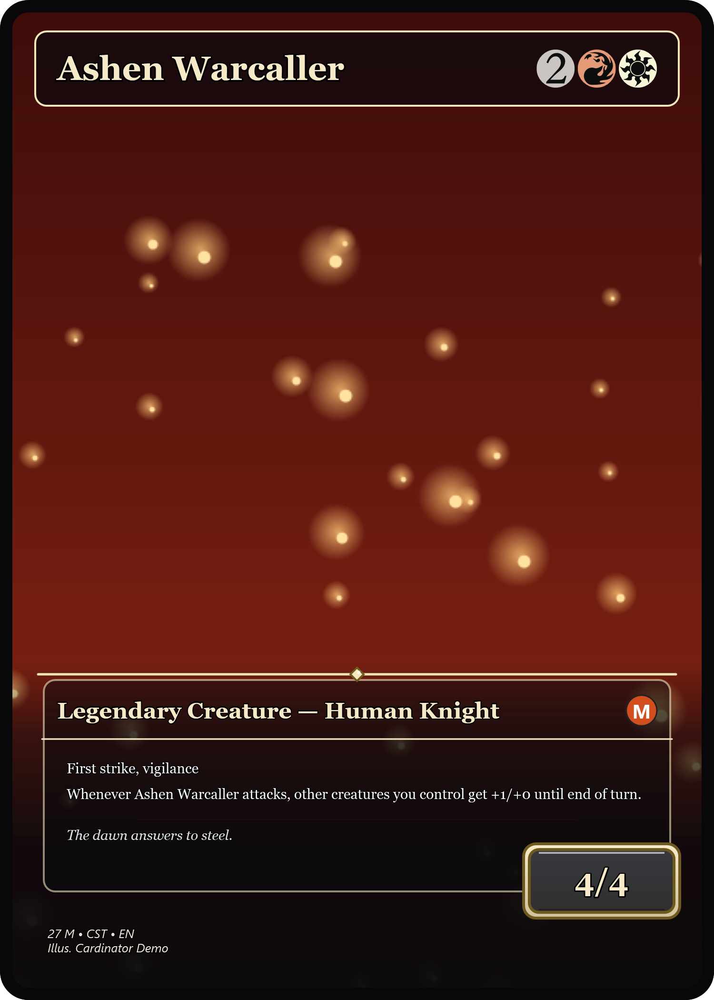

---

## Ornate — metallic band, banner, corner scrollwork (`ornate`)

A heavily decorated frame: a metallic gradient band with stone texture, a title banner, bold corner
scrollwork with gems, a filigree divider, and tapered gold edge accents. The P/T box sits in a
beveled metallic seat.

  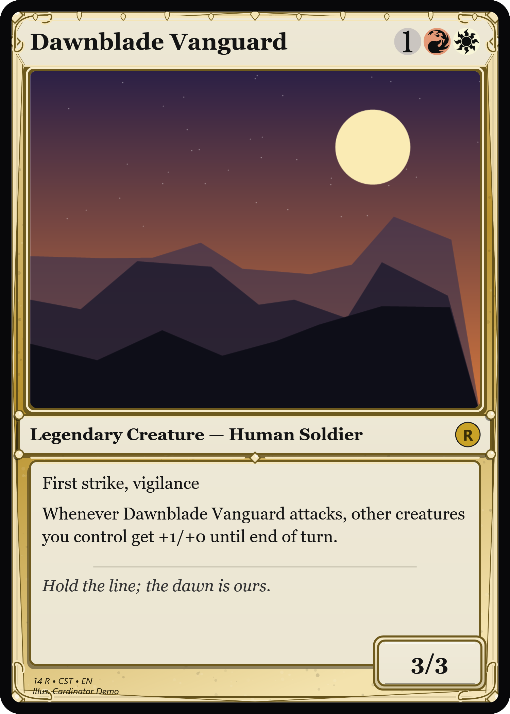
  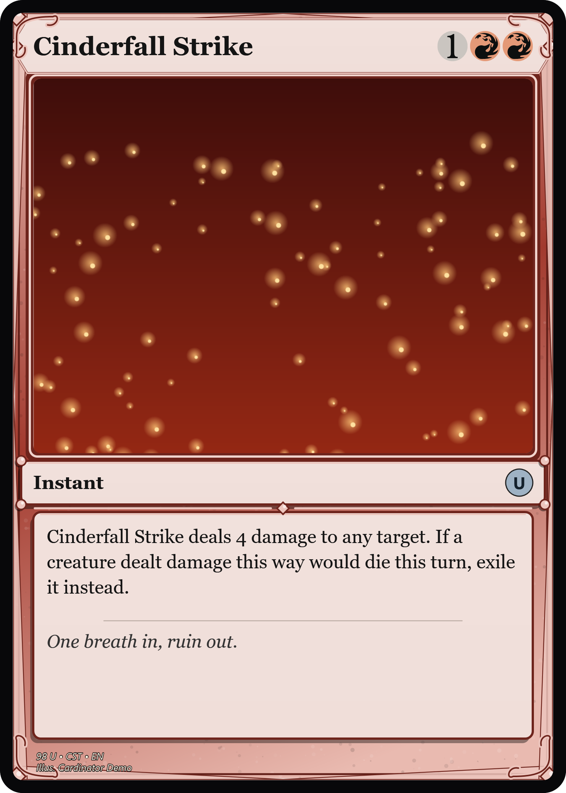
  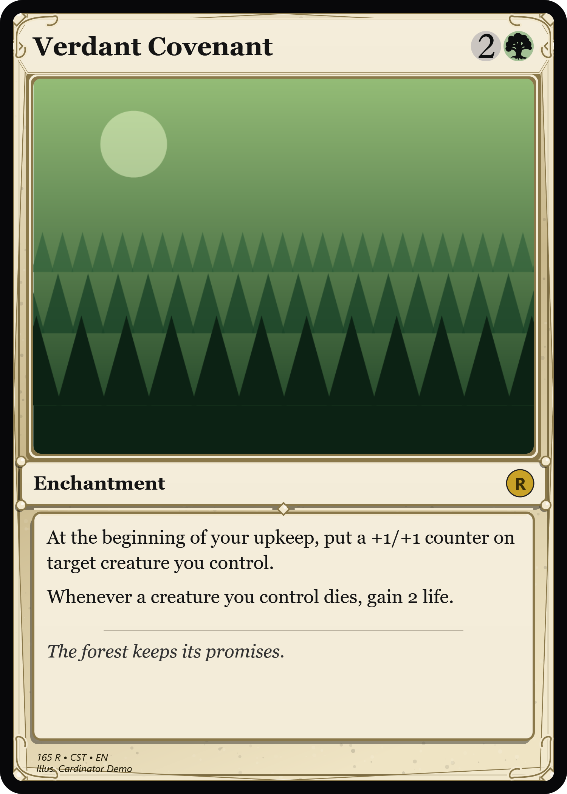

---

## Clean — flat, modern slab (`clean`)

Crisp flat panels, bold keylines, no filigree — a contemporary look. Shown on a creature, an
artifact, and a planeswalker.

  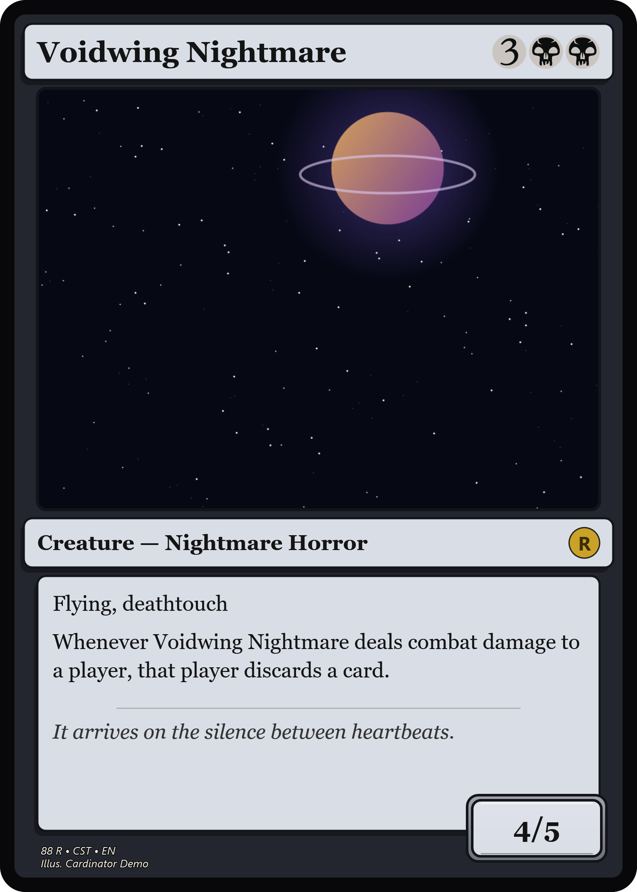
  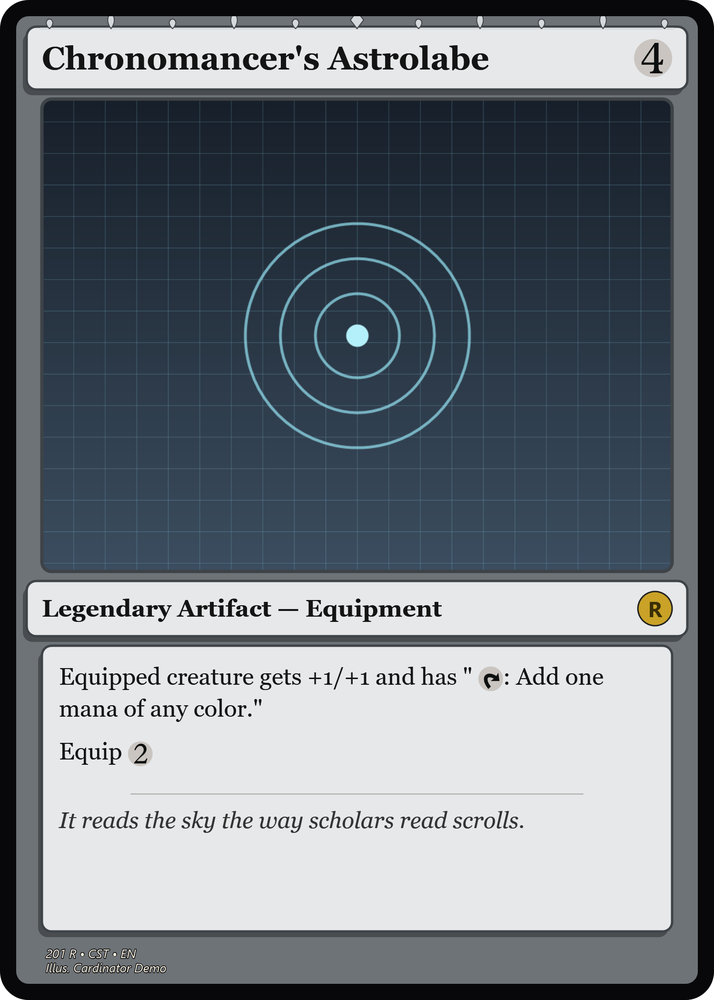
  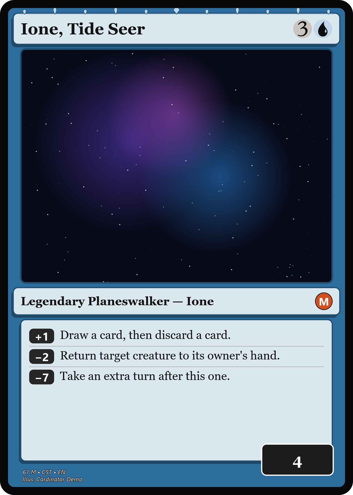

---

## Classic — gradient border, beveled panels, filigree (`classic`)

The default MTG-style look: a gradient border, beveled art window and panels, corner filigree, a
leafy crown on Legendary cards, and loyalty badges on planeswalkers.

  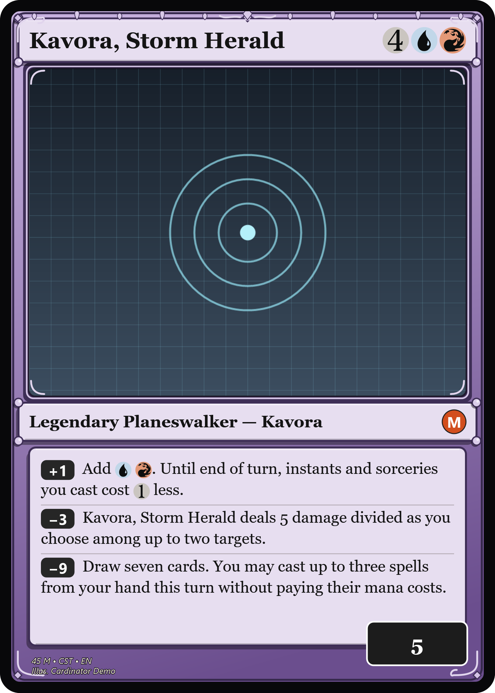
  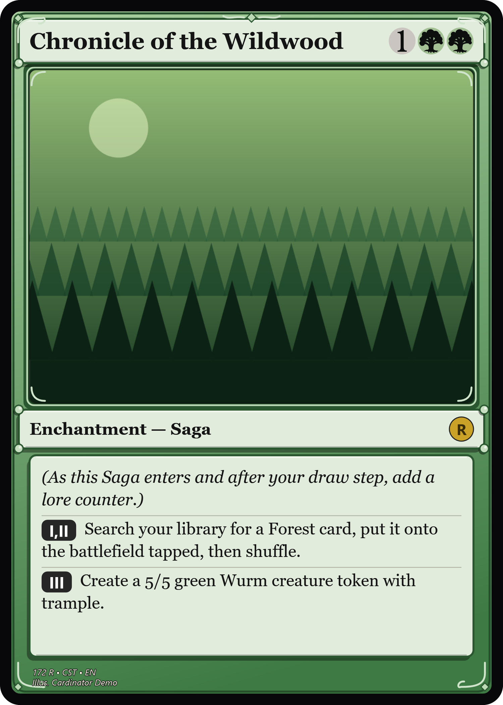

---

## Faded — the frame melts into the art (`faded`)

Wide gradient bands dissolve the frame into the artwork on all four sides — no hard keyline. Shown on
an Adventure card (note the spell sub-box).

  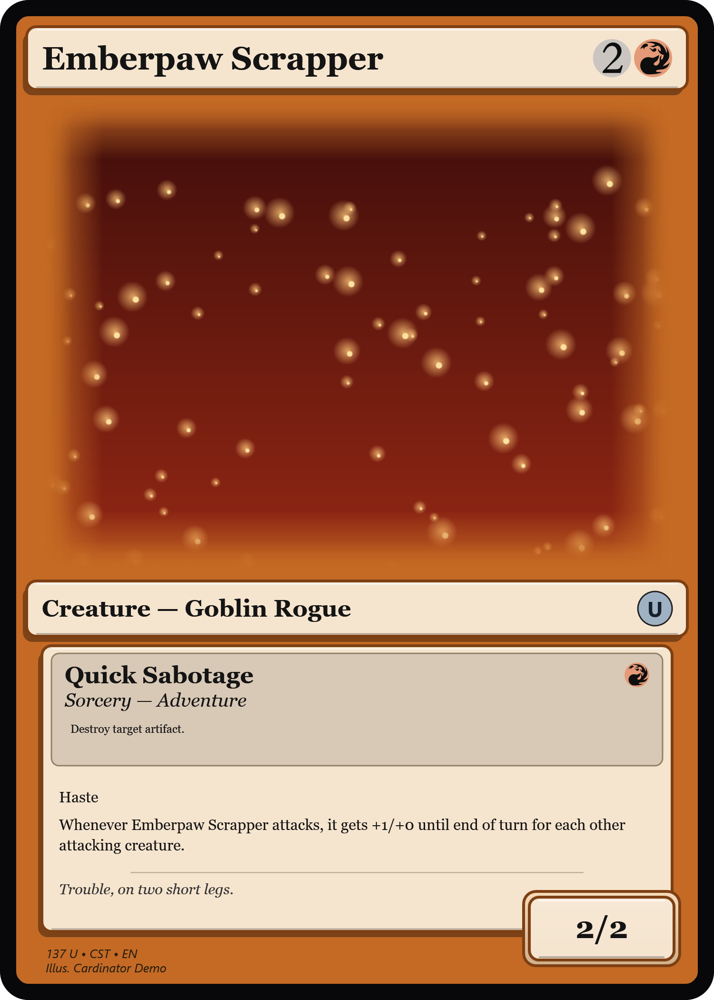

---

## Borderless — full-bleed art, floating panels (`borderless`)

No frame at all — the art runs to the edge and translucent panels float over it for the text.

  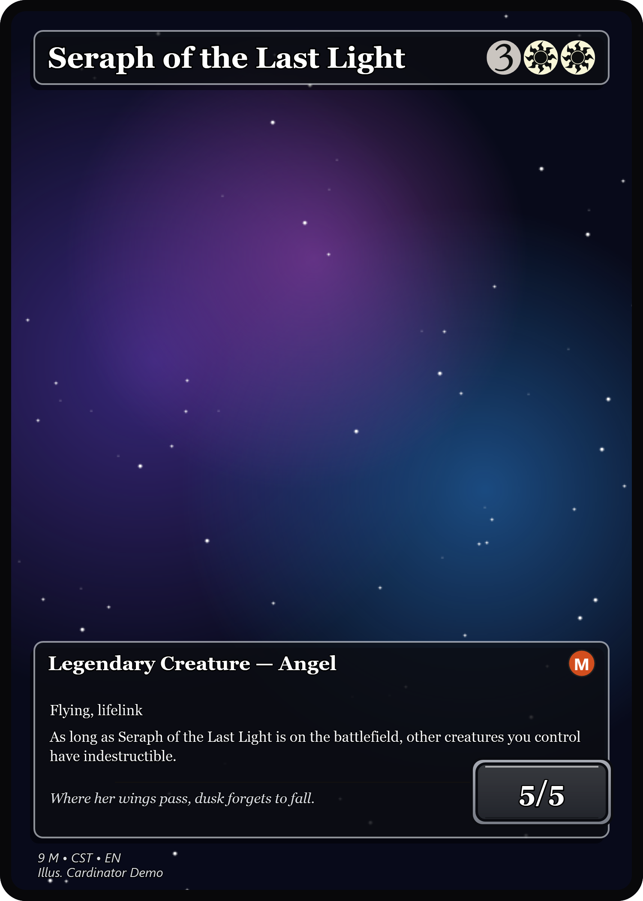

---

## Full art — text directly on the artwork (`fullArt: true`)

The artwork is the whole card; the text sits on it with a subtle legibility scrim and a shadowed
font. The generated frame is just a thin edge.

  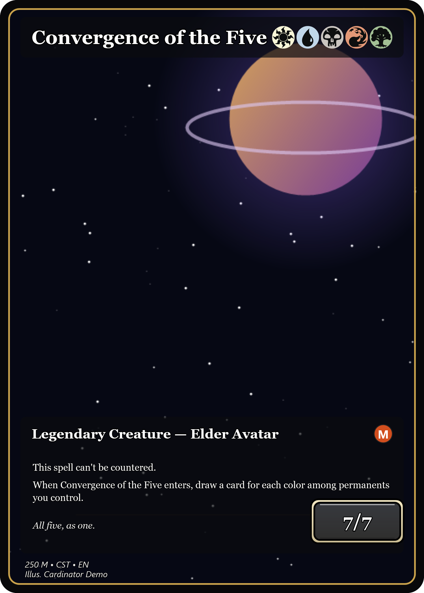

---

*Want to see one card on every installed frame at once? Run `Cardinator.exe --frames <outDir>` — it
renders the same sample card on each frame, including any you've imported.*
