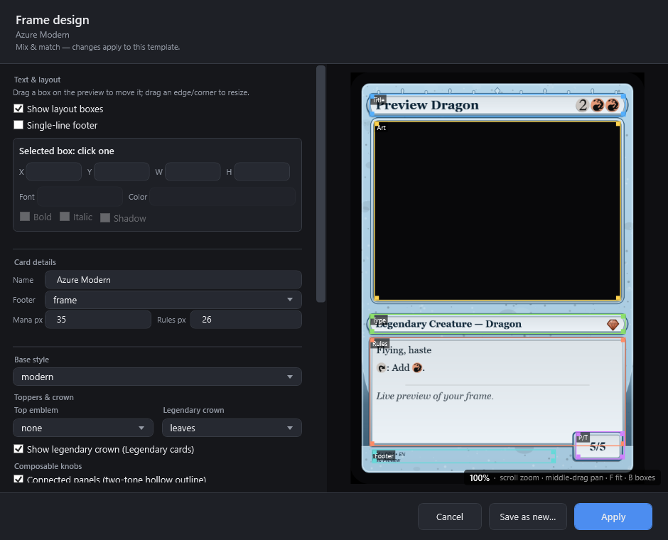
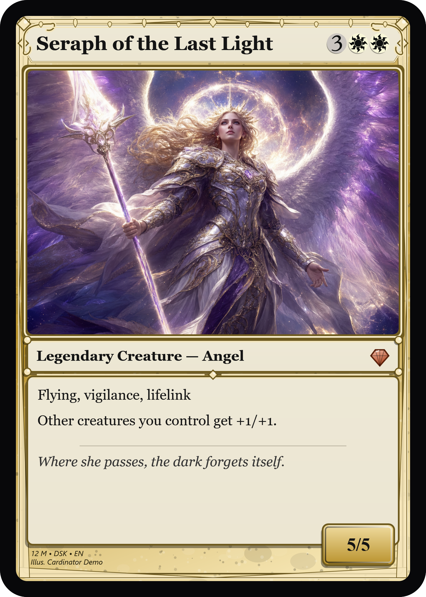
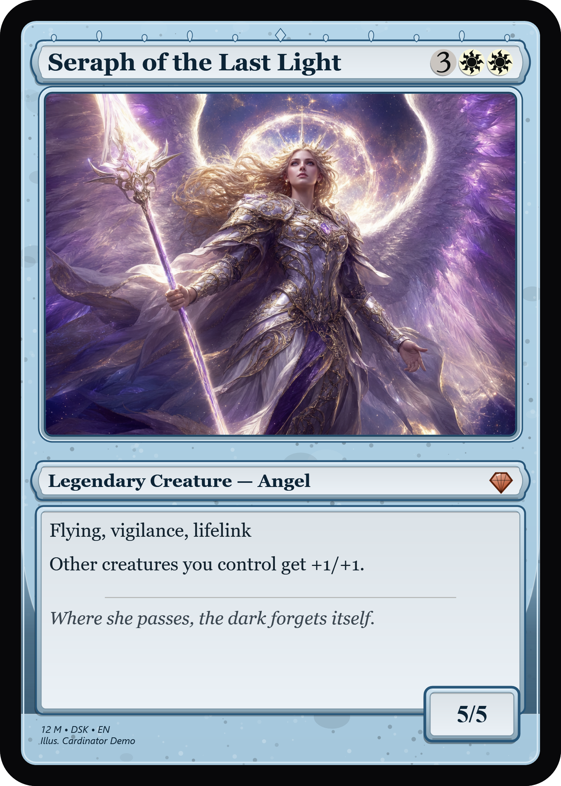
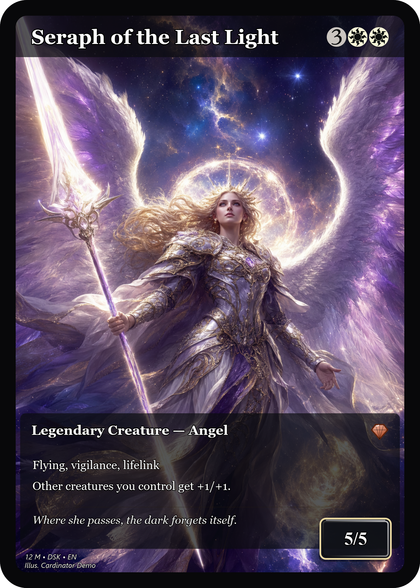

# Cardinator — Quick Start

*This guide is generated automatically by `Cardinator.exe --docs`; the screenshots are the real app.*

Cardinator makes custom Magic-style cards from your own art — one at a time, or hundreds at once.


## Make one card

1. **Name it.** Type a name in the CARD NAME box — that's just your card's title.
2. **Pick a frame.** Choose one from the FRAME dropdown (its own row), with **Design…**,
   **Import…**, **Export…** and **Delete…** beneath it. Click **Design…** to mix and match the
   frame's look (below). Different cards in a set can use different frames.
3. **Add your art.** Click **Change art…**, **Paste** a copied image or URL, or just drag an image
   onto the window. Paste even handles images copied from a web browser. Drag the preview to pan,
   scroll to zoom (hold **Ctrl** for fine zoom); click the preview then use the **arrow keys** to
   nudge the art a pixel at a time and **+ / -** to zoom.
4. **Edit the details.** Click **Edit details…** for mana cost, type line, rules/flavor text,
   power/toughness, loyalty, set, collector number, artist and more. Type mana as `{2}{U}{U}` —
   it renders as symbols, in the title and inside rules text.
5. **Borrow real stats (optional).** Inside **Edit details…**, use **Fill from Scryfall**: type any
   real card name and it fills the mana cost, type, rules text, power/toughness and printing info —
   while leaving your card's **name, art and frame untouched**. So you can call a card "Boogie
   Woogie" and still pull Lightning Bolt's stats.
6. **Watch the CHECKS panel.** It flags problems as you go — missing art, an unrecognized symbol, a
   footer overlapping the text box, duplicate collector numbers — so nothing surprises you at export.
7. **Export.** Click **Export PNG…** for a print-quality image, or **Copy image** to paste it
   straight into a chat. **Open output folder** opens wherever you last exported.

### Editing the details (with Scryfall fill)


### Designing the frame
Mix and match the frame's style, connected panels, textured background, bottom taper, top emblem,
royal sub-border, border thickness and colors — all live. **Apply** saves your changes; **Save as
new…** keeps the original untouched and creates a fresh, editable frame. Built-in frames are
protected — editing one offers to save a copy instead, and **Delete…** only removes your own frames.



### Importing a frame
Click **Import…** to add a frame: pick a **PNG**, a **.cardframe**, or a **.zip** bundle from your
PC with the **Choose file…** button, or paste a web link. A `.cardframe`/`.zip` bundle keeps its
tuned regions; a bare image gets default regions you can tune. Imported frames are copied into the
app's data folder, so the original file can move or be deleted afterwards.

## Frames at a glance
| Gold Multicolor | Azure Modern | Full Art |
|---|---|---|
|  |  |  |

## Make a whole set at once

1. Put your card names in a text or CSV file — one per line, or with columns for art and frame:
   ```
   Lightning Bolt, bolt.png, Crimson Red
   Counterspell,   counter.png, Ocean Blue
   ```
2. Click **Import list / CSV…** (or drop the file on the window). Cardinator fills any blank fields
   from Scryfall and matches art files by name.
3. Click **Look up missing** if you left fields blank, and **Match art folder…** to attach a folder
   of images by filename.
4. Use **Set fields on all…** to apply one frame (and/or set code, artist, rarity, copyright) to
   every card at once — blank fields are left unchanged, so you can re-frame a whole set in one step.
5. **Export all…** writes every card to a PNG, or **Print sheet…** lays them out at real card size
   on Letter/A4 pages (with cut marks and optional bleed) ready to print.

## Saving a set
**Save** writes your project into a **set folder**: the project file plus an `art/` subfolder (your
images are copied in) and an `out/` subfolder (where exports and sheets default). The whole folder is
self-contained — move, zip or share it and every card still finds its art. One-off single cards need
no setup: the folder is only created when you first save.

## Keyboard shortcuts
`Ctrl+S` save · `Ctrl+O` open · `Ctrl+N` new · `Ctrl+L` look up · `Ctrl+E` export · `Ctrl+D` duplicate · `F1` help
· click the preview, then **arrows** nudge art (Shift = 10px) and **+/-** zoom

---
*Cardinator is for personal/fan use. Card frames and symbols are original; it isn't affiliated with
Wizards of the Coast.*