# Making your own frames

A **template** is how Cardinator knows where to put the art, title, mana, type line, rules box and
power/toughness — and what the frame looks like. Templates live in:

```
CardinatorData/templates/<your-template-name>/
    template.json     <- the layout (coordinates, fonts, colors)
    frame.png         <- the frame image drawn over the art (optional)
```

Every template shows up in the app's **Frame** dropdown.

## The built-in frames

Cardinator ships with these frames (all generated by the app — the same sample card on each, so you
can compare the styles). Pick one from the **Frame** dropdown, or duplicate one and tweak it.

<table>
<tr>
<td align="center">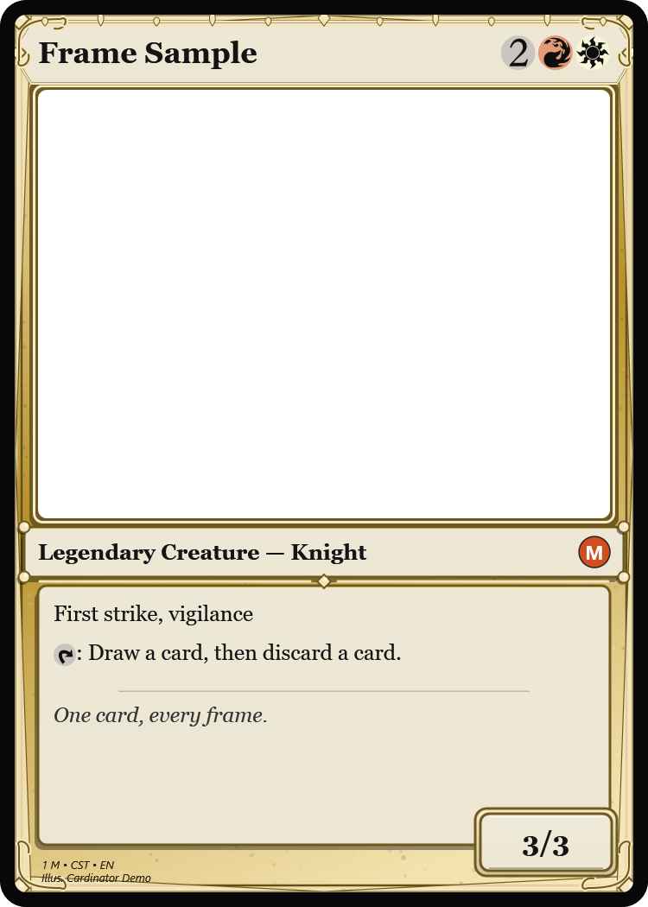<br/><sub>Gold Multicolor</sub></td>
<td align="center">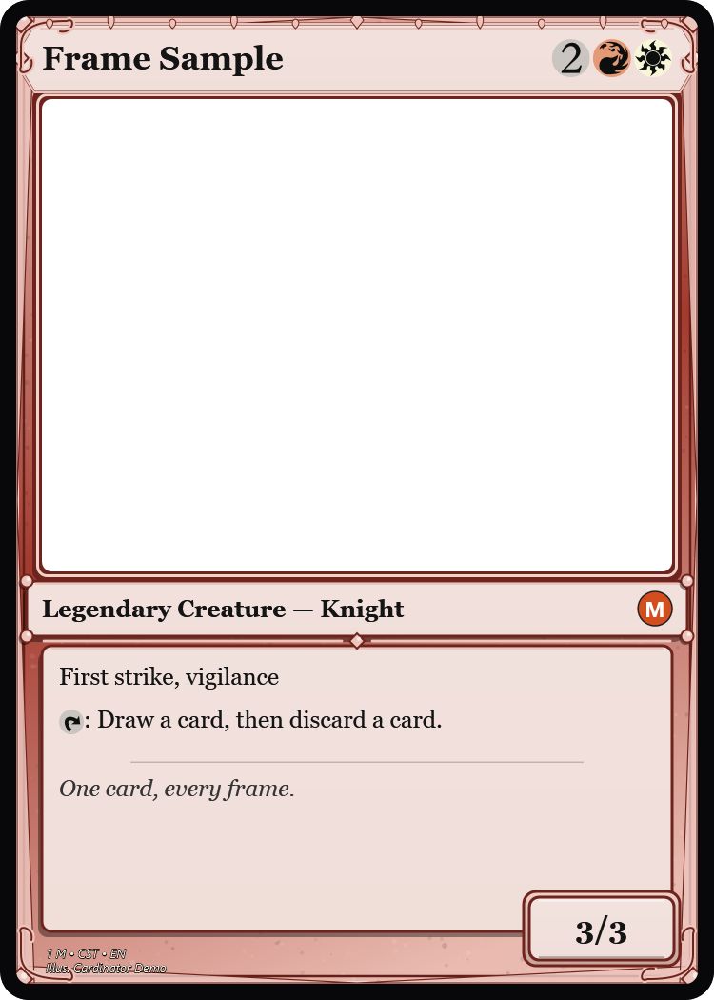<br/><sub>Crimson Red</sub></td>
<td align="center">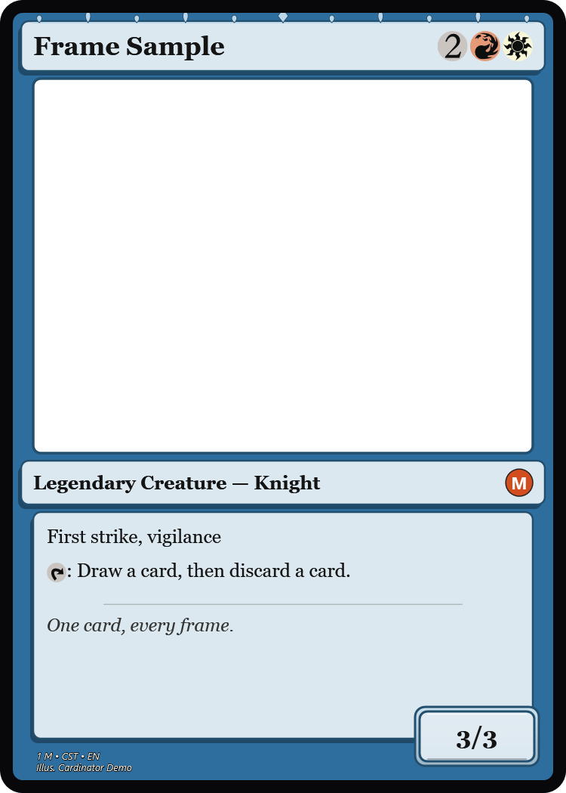<br/><sub>Ocean Blue</sub></td>
<td align="center">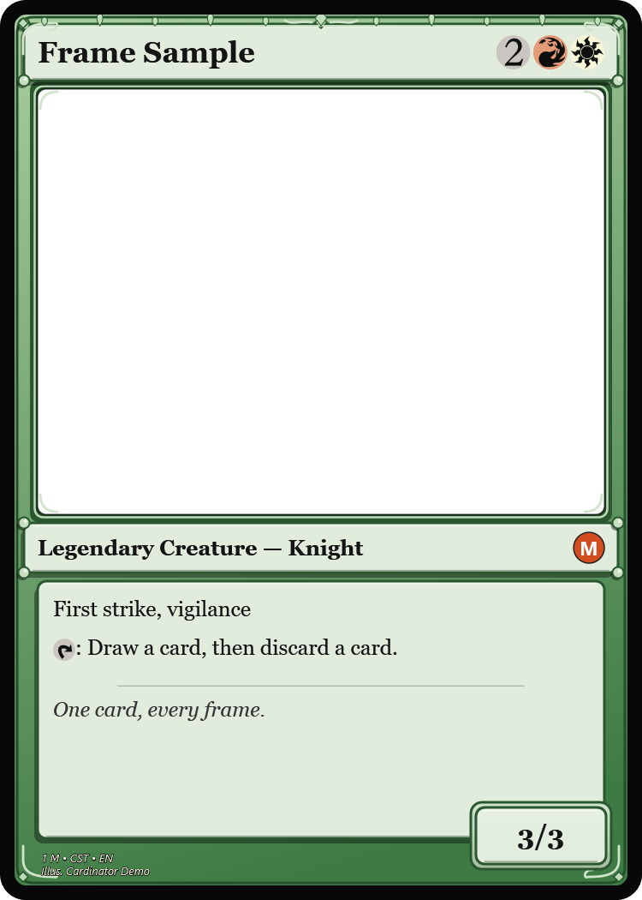<br/><sub>Forest Green</sub></td>
<td align="center">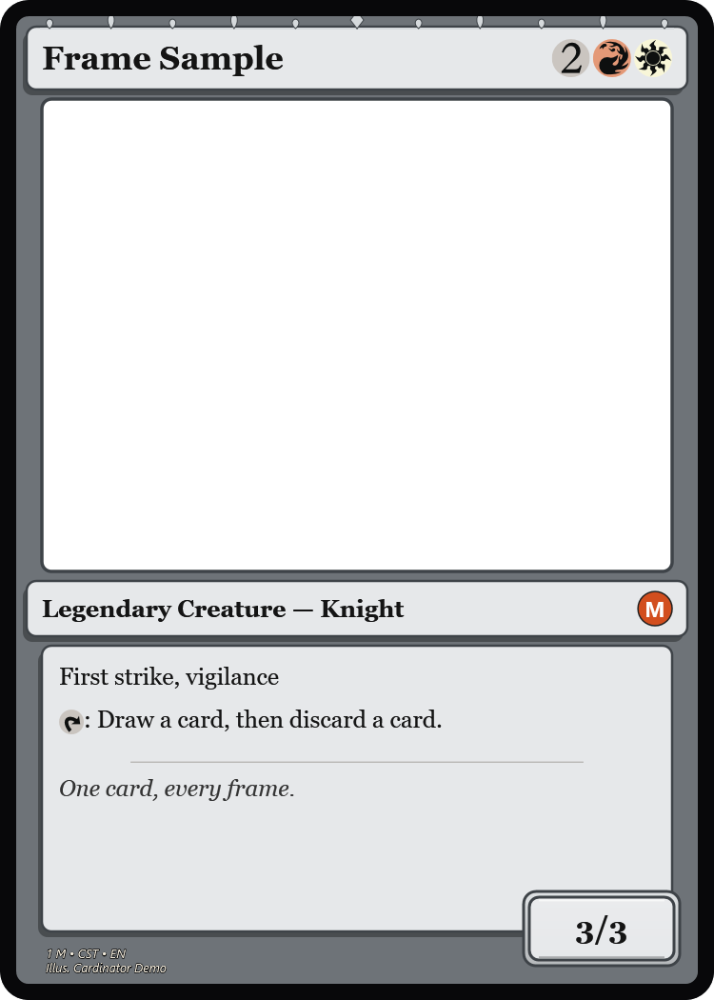<br/><sub>Slate Artifact</sub></td>
</tr>
<tr>
<td align="center">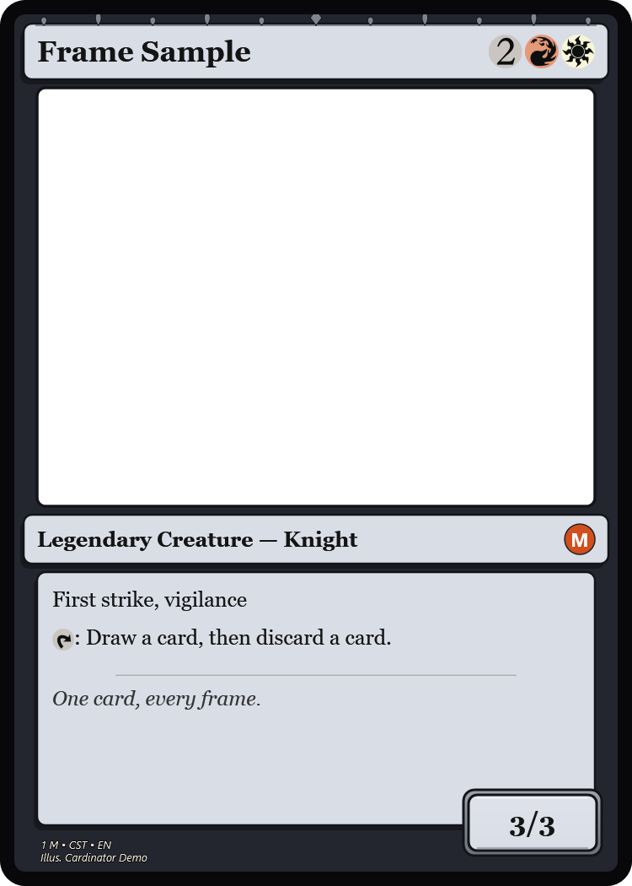<br/><sub>Midnight</sub></td>
<td align="center">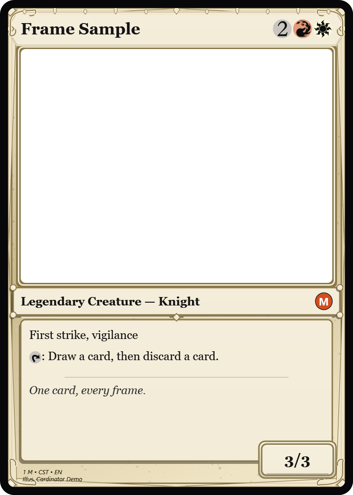<br/><sub>Parchment</sub></td>
<td align="center">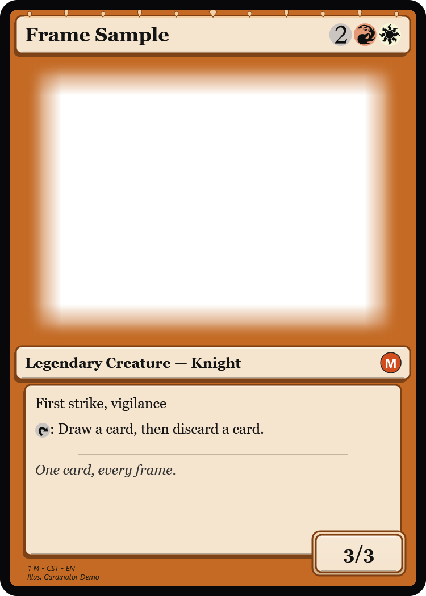<br/><sub>Sunset Orange</sub></td>
<td align="center">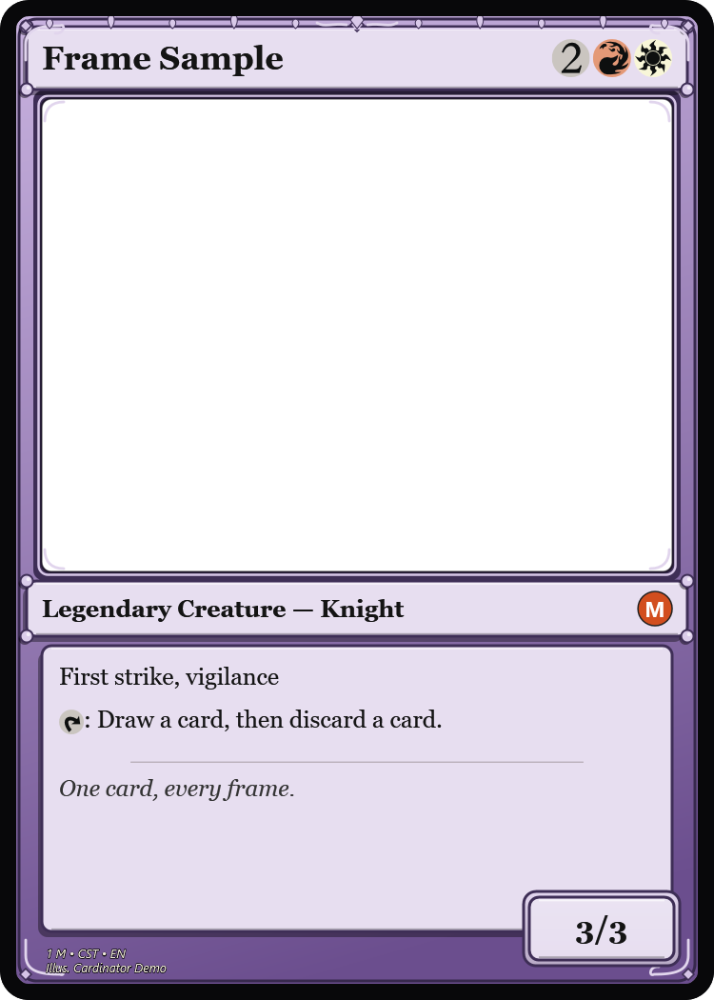<br/><sub>Planeswalker</sub></td>
<td align="center">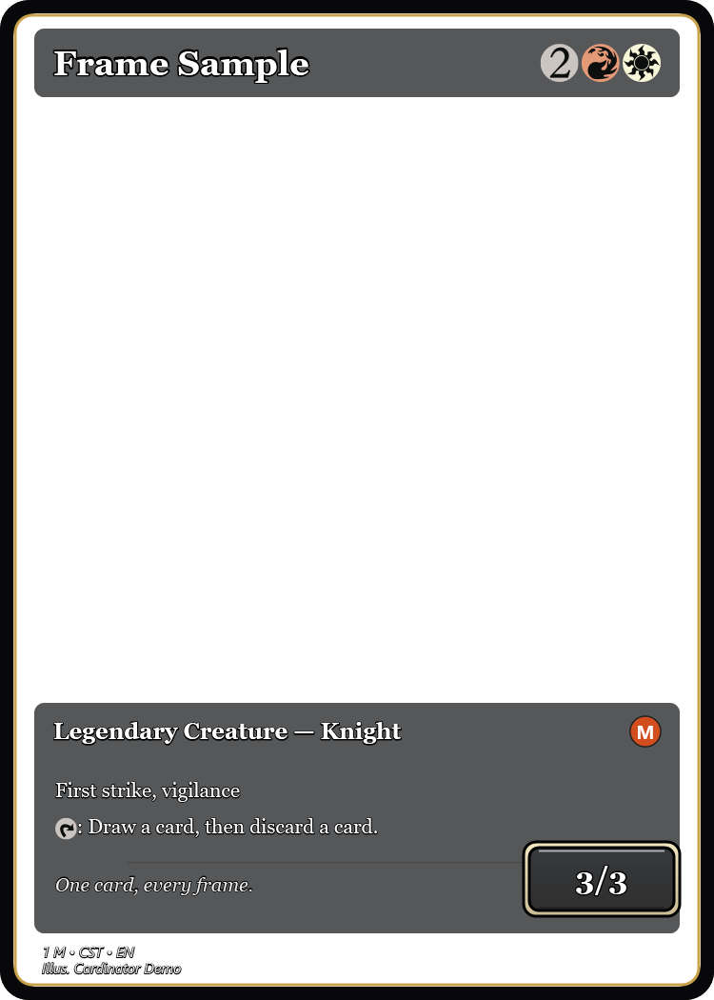<br/><sub>Full Art</sub></td>
</tr>
<tr>
<td align="center">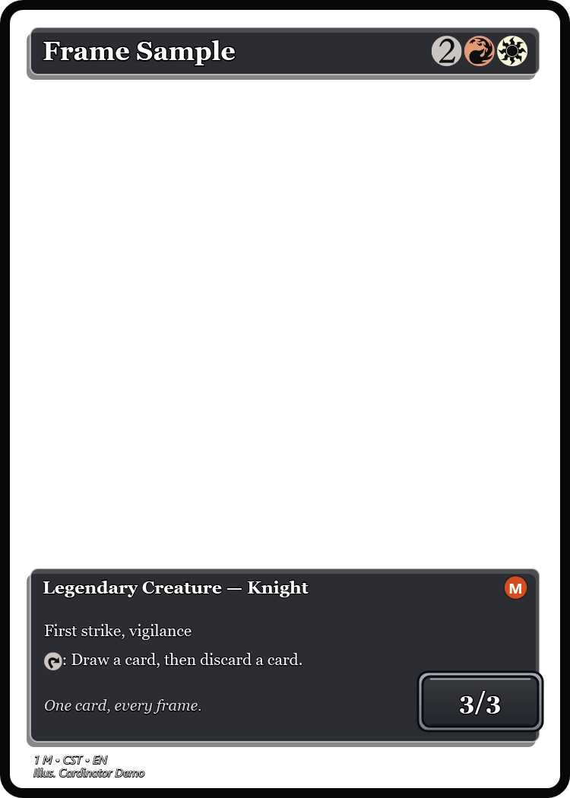<br/><sub>Showcase (borderless)</sub></td>
<td align="center">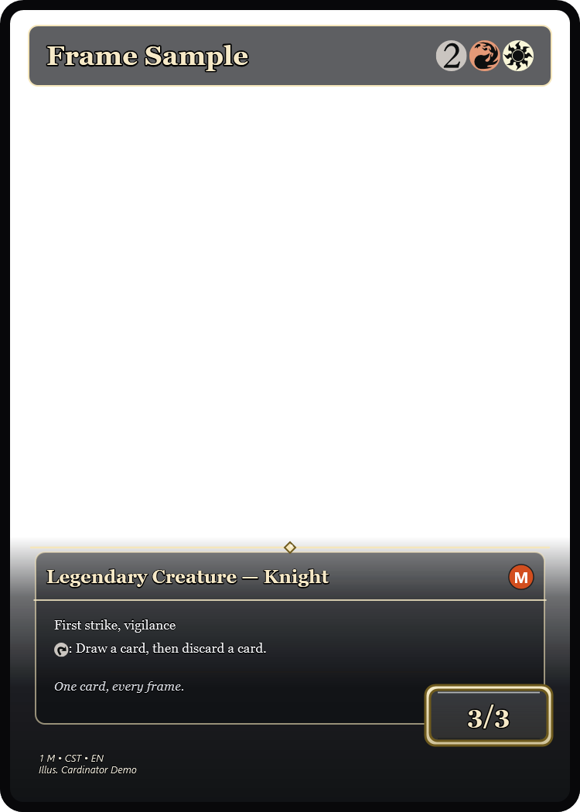<br/><sub>Cinematic (overlay)</sub></td>
</tr>
</table>

Frames come in a few **styles** you can set per template (`frameStyle`): **classic** (gradient +
bevel), **clean** (flat/modern), **ornate** (metallic band, banner, corner scrollwork + gems, stone
texture), **faded** (edges melt into the art), **borderless** (full-bleed art + floating panels), and
**overlay** (full-bleed art with a cinematic band + gold trim carrying the text over the bottom of
the art). Legendary cards also get a leafy crown, and the P/T box only appears on creatures.

*(Generate this grid yourself any time with `Cardinator.exe --frames <outDir>` — it renders one card
on every frame you have installed, including your own imports.)*

## Tweaking a frame's style

Start from a default and fiddle. Copy a folder under `CardinatorData/templates/`, **delete its
`frame.png`** (so it regenerates), and edit `template.json`. The handy style knobs:

- **`frameStyle`** — `"classic"` (gradient border + beveled panels), `"clean"` (flat/modern),
  `"ornate"` (metallic band, banner, corner scrollwork + gems, stone texture), `"faded"` (edges
  melt into the art), `"borderless"` (full-bleed art + floating translucent panels), or `"overlay"`
  (full-bleed art with a cinematic band + gold trim carrying the text over the bottom of the art).
- **`colors`** — `border` / `frame` / `frame2` (the frame gradient) / `panel` / `panelBorder`.
- **`embellishments`** — `true`/`false` to turn the ornamental filigree on or off.
- **`cornerRadius`** / **`panelRadius`** — rounded vs. sharp corners for the card and the panels.
- **fonts** — per region: `size`, `color`, `bold`, `italic`, `align`, `shadow`.
- **regions** — move/resize the art window, title, type line, text box and P/T.

Restart the app (or select a card) and Cardinator regenerates the frame from your edits. Prefer to
draw the whole thing yourself? Supply your own `frame.png` — see
[Importing a frame you already have](#importing-a-frame-you-already-have).

---

## The two files

### `template.json`
Describes the layout in a fixed **750 × 1050** logical space (a 5:7 card). Cardinator renders the
preview at this size and scales up ×2 on export (to 1500 × 2100).

### `frame.png`
The frame overlay, drawn **on top of** the art. It must be **transparent where the art shows
through** (the art window). If `frame.png` is missing, Cardinator **generates one** from the colors
and rectangles in `template.json` — so you can design a whole frame with JSON alone, or drop in
your own hand-made PNG (for example an authentic MTG-style frame) and Cardinator will just lay text
over it.

> If you supply your own `frame.png`, make its transparent art window line up with the `artWindow`
> rectangle in `template.json`.

---

## Quickest way to make one

1. Copy an existing folder under `CardinatorData/templates/` (e.g. `ocean-blue`) to a new name.
2. Open its `template.json` and change `name`, the `colors`, and any rectangles/fonts you want.
3. **Delete the `frame.png`** in your copy (so Cardinator regenerates it from your edits) — or
   replace it with your own transparent PNG.
4. Restart Cardinator. Your template appears in the dropdown.

Cardinator is resilient about template files: a missing or corrupt `template.json`/`frame.png` for
a built-in template is repaired automatically, invalid colors fall back to black, and a bad font
name falls back to a default — so a small typo won't take the app down.

---

## `template.json` reference

```jsonc
{
  "name": "Ocean Blue",          // shown in the Frame dropdown
  "canvasWidth": 750,            // logical canvas (keep 750 x 1050 for a normal card)
  "canvasHeight": 1050,
  "fullArt": false,             // true = art fills the whole card, text sits on it (see below)
  "frameStyle": "classic",      // classic | clean | ornate | faded | borderless | overlay
  "embellishments": true,       // ornamental corner scrolls / art-window curls / top ornament
  "cornerRadius": 30,           // card-edge rounding (0 = square corners)
  "panelRadius": 10,            // art window + text panel rounding

  // Colors used ONLY when Cardinator generates frame.png for you.
  "colors": {
    "border":      "#0A1622",    // outer edge
    "frame":       "#1E5B8A",    // main frame color
    "frame2":      "#5AA9DD",    // frame highlight (gradient)
    "panel":       "#EAF1F6",    // title / type / text box fill
    "panelBorder": "#0A3550"
  },

  // Rectangles: x, y = top-left; w, h = size (all in the 750x1050 space).
  "titleBar":   { "x": 28,  "y": 28,   "w": 694, "h": 66  },  // name + mana cost
  "artWindow":  { "x": 44,  "y": 104,  "w": 662, "h": 496 },  // your artwork
  "typeBar":    { "x": 28,  "y": 610,  "w": 694, "h": 58  },  // type line + rarity pip
  "textBox":    { "x": 44,  "y": 678,  "w": 662, "h": 300 },  // rules + flavor
  "ptBox":      { "x": 596, "y": 966,  "w": 126, "h": 66  },  // power/toughness (or loyalty)
  "creditBar":  { "x": 46,  "y": 1006, "w": 540, "h": 28  },  // collector / set / artist footer

  // Fonts: family, size (logical px), color (#hex or name), bold, italic, align (left|center|right),
  //        shadow (outline behind the text for legibility on art), shadowColor.
  "titleFont":  { "family": "Georgia",  "size": 34, "bold": true },
  // e.g. white shadowed title for text on art:
  //   "titleFont": { "family":"Georgia", "size":36, "bold":true, "color":"#FFFFFF", "shadow":true },
  "typeFont":   { "family": "Georgia",  "size": 25, "bold": true },
  "rulesFont":  { "family": "Georgia",  "size": 25 },
  "flavorFont": { "family": "Georgia",  "size": 24, "italic": true, "color": "#333333" },
  "ptFont":     { "family": "Georgia",  "size": 32, "bold": true, "align": "center" },
  "creditFont": { "family": "Segoe UI", "size": 15, "italic": true, "color": "#241F0C" },

  "manaSymbolSize":  40,   // diameter of mana pips in the title bar
  "rulesSymbolSize": 26    // height of symbols embedded inside rules text
}
```

### Tips

- **Moving the art window** is the biggest visual change — a taller `artWindow` (with a shorter
  `textBox`) gives a more art-forward card.
- Keep `titleBar`, `typeBar` and `textBox` from overlapping, or text will collide.
- The **rarity pip** is drawn at the right end of the `typeBar`; leave a little room there.
- Colors accept `#RRGGBB`, `#AARRGGBB`, or common names (`Red`, `Black`, …). An invalid value
  falls back to black rather than breaking the template.
- Fonts must be installed on the PC. An unavailable font falls back to a default automatically.

---

## Two template styles

Cardinator supports two looks, both driven by `template.json`:

1. **Framed** (default) — text sits on opaque panels (title bar, type bar, rules box), with the art
   showing through a window. This is the classic Magic look (the built-in colored frames).
2. **Full art** (`"fullArt": true`) — the artwork fills the **whole card** and the text sits
   **directly on the art**, kept legible by a subtle scrim behind each text area plus a per-font
   `shadow` outline. The generated frame is just a thin border. The built-in **Full Art** template
   is a ready example; set light, shadowed fonts and tune `titleBar` / `typeBar` / `textBox` to
   position the text over the art. Change font `size` / `color` per region to taste.

## Importing a frame you already have

If you have your own frame image (a transparent PNG whose center is the art window), you don't need
to write JSON by hand:

- **In the app:** click **Import…** next to the Frame dropdown, choose your PNG. Cardinator creates
  the template and selects it. It writes a starter `template.json` you can then tune.
- **From a file or URL (command line):**

  ```powershell
  Cardinator.exe --newtemplate "My Frame" C:\frames\myframe.png
  Cardinator.exe --newtemplate "Showcase" https://example.com/frame.png fullart
  ```

Your image is kept exactly as provided (Cardinator won't regenerate it). Then open the new
`template.json` and adjust the region rectangles so the art window and text areas line up with your
frame.

### Where do frames come from?

Cardinator doesn't ship a catalog of frames to download, and it deliberately doesn't pull them from
anywhere online — the authentic Magic frames are Wizards of the Coast's, and community frame packs
are mostly derived from them. So there's nothing to "browse and download" in the app (Scryfall,
which the app uses for card text/art/symbols, has no blank frame templates either).

What *is* built in and safe:

- **The generated frames** — the built-ins (Crimson Red, Ocean Blue, Full Art, …) are drawn by the
  app from `template.json`. Copy one, change its colors/regions, and you have a new frame with no
  image at all.
- **Any transparent PNG you provide** — draw your own, or point Cardinator at a frame image you have
  the rights to use. The **Import…** button takes a **local file or a URL**
  (`--newtemplate "Name" https://…/frame.png` on the command line). What you use it with is up to
  you; for anything Magic-derived, keep it to personal / fan use.

A frame image should be a **transparent PNG the size of a card** (or 5:7), opaque only where you
want frame/border/panels and see-through where the art and text should show. Add `fullart` on import
for an art-fills-the-card look (text sits on the art); otherwise the default windowed regions apply.

## Sharing templates

A template is self-contained in its folder — zip up
`CardinatorData/templates/<name>/` and share it. The recipient drops it into their own
`CardinatorData/templates/` and restarts the app.
