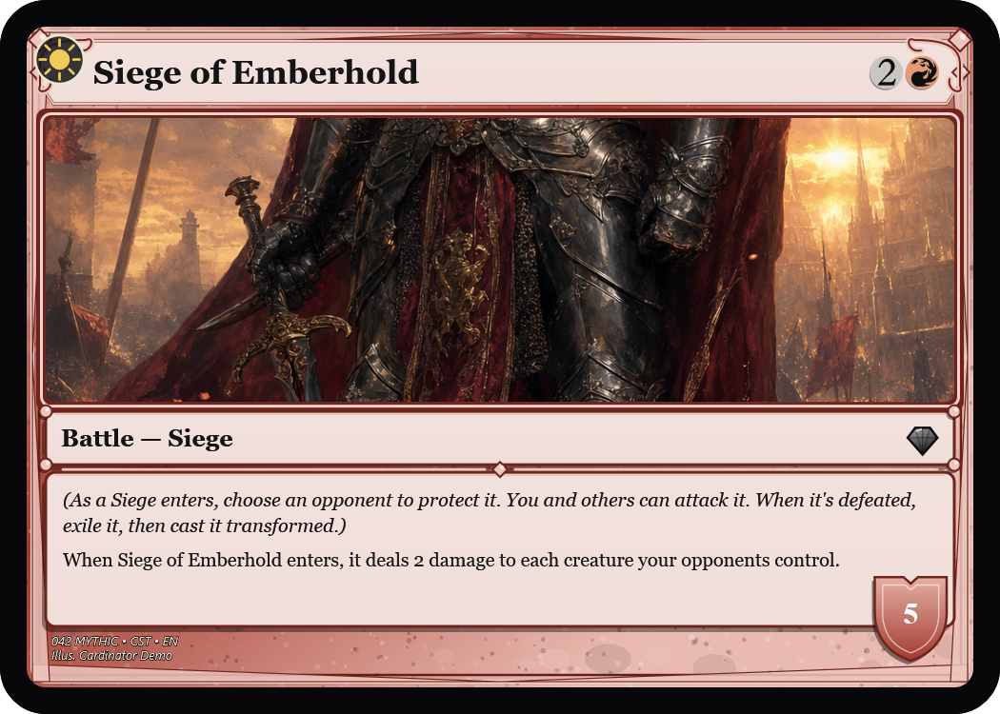
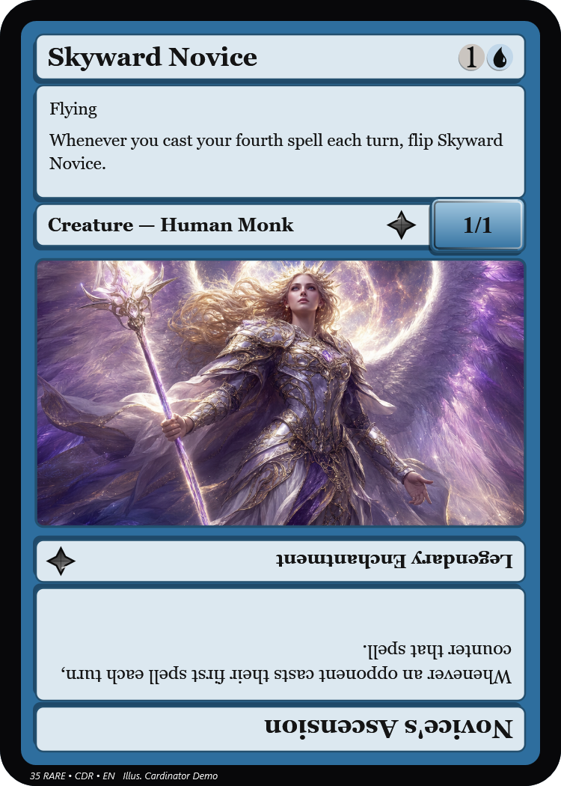
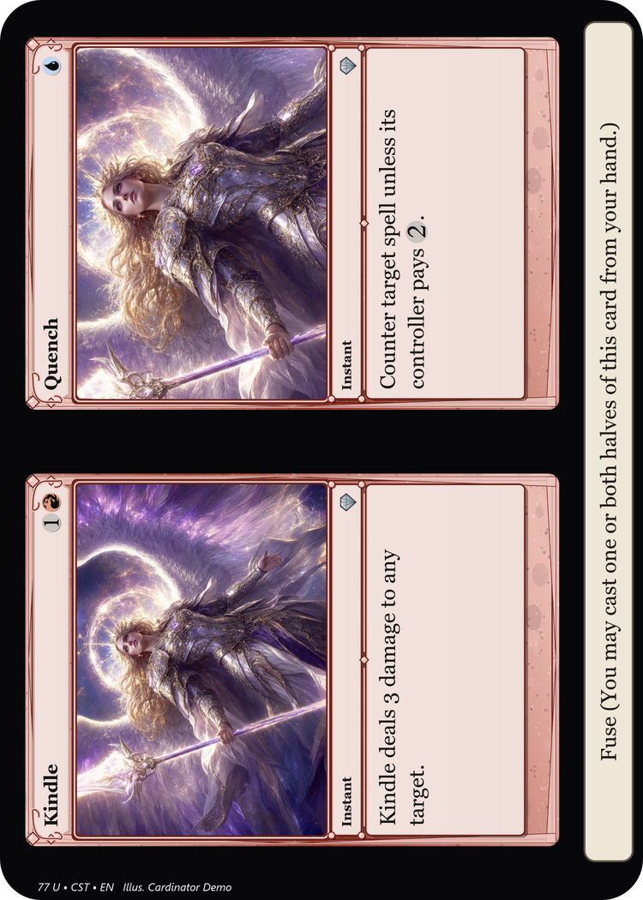
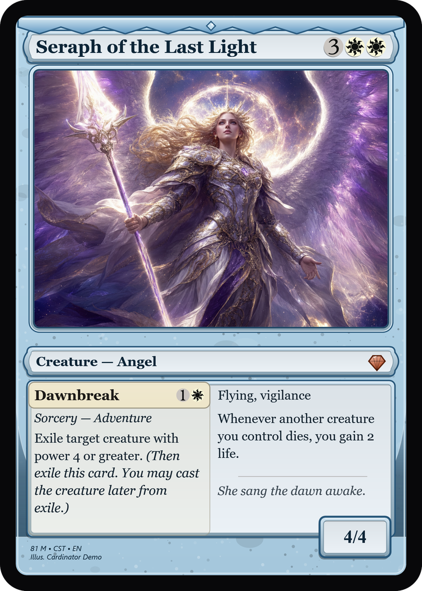
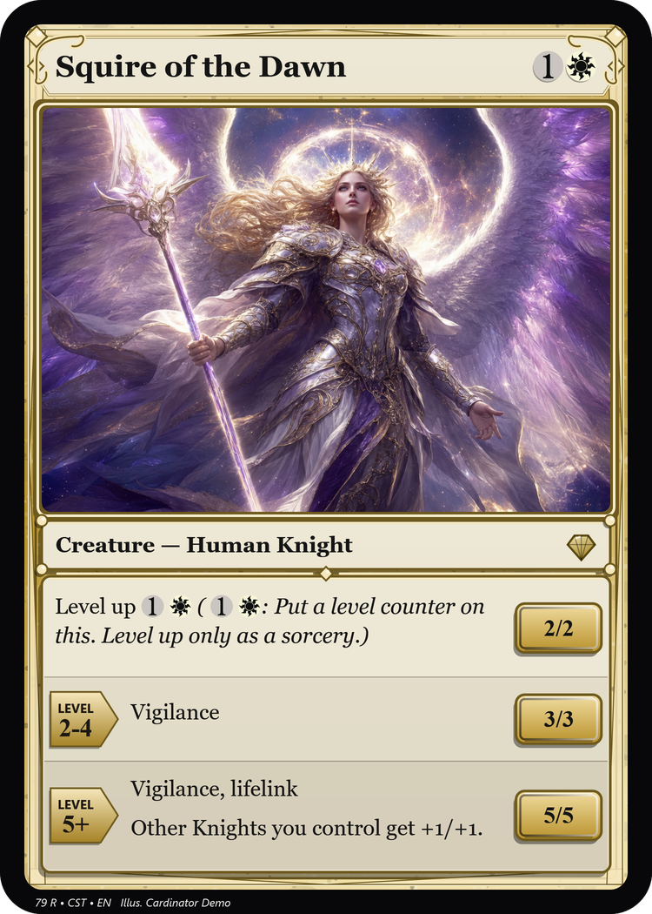
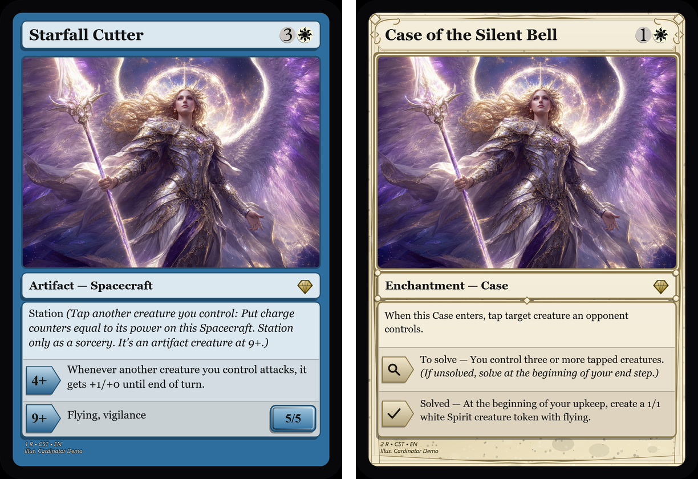
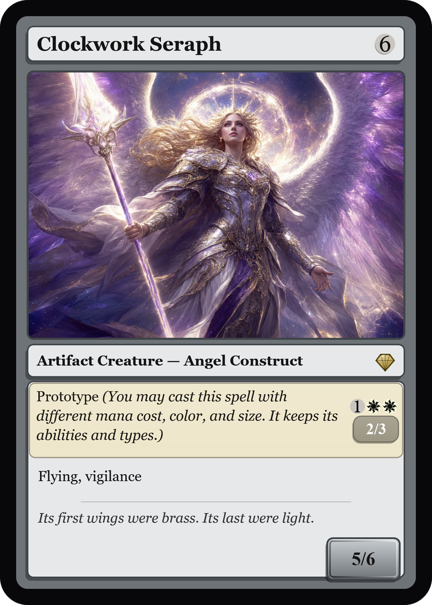
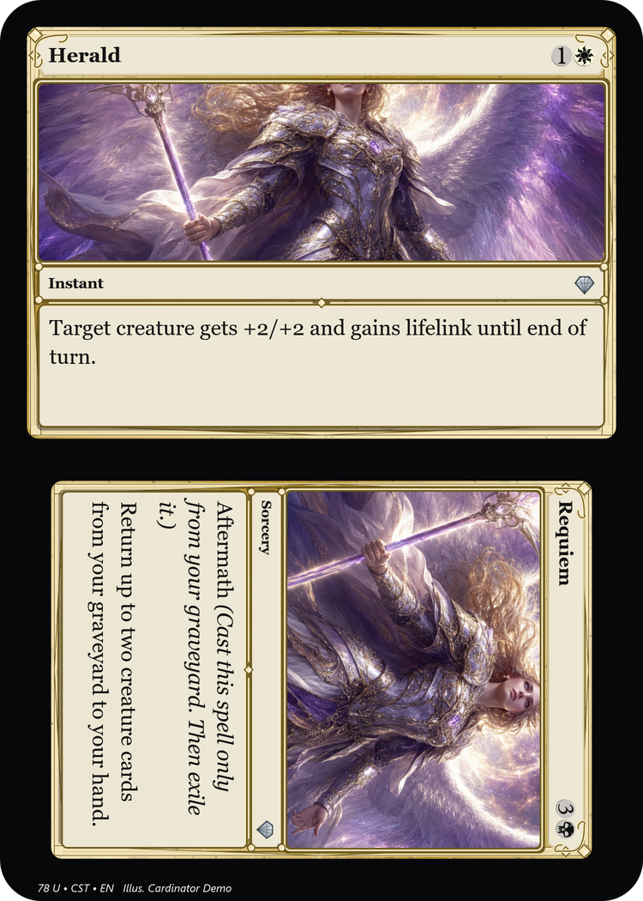
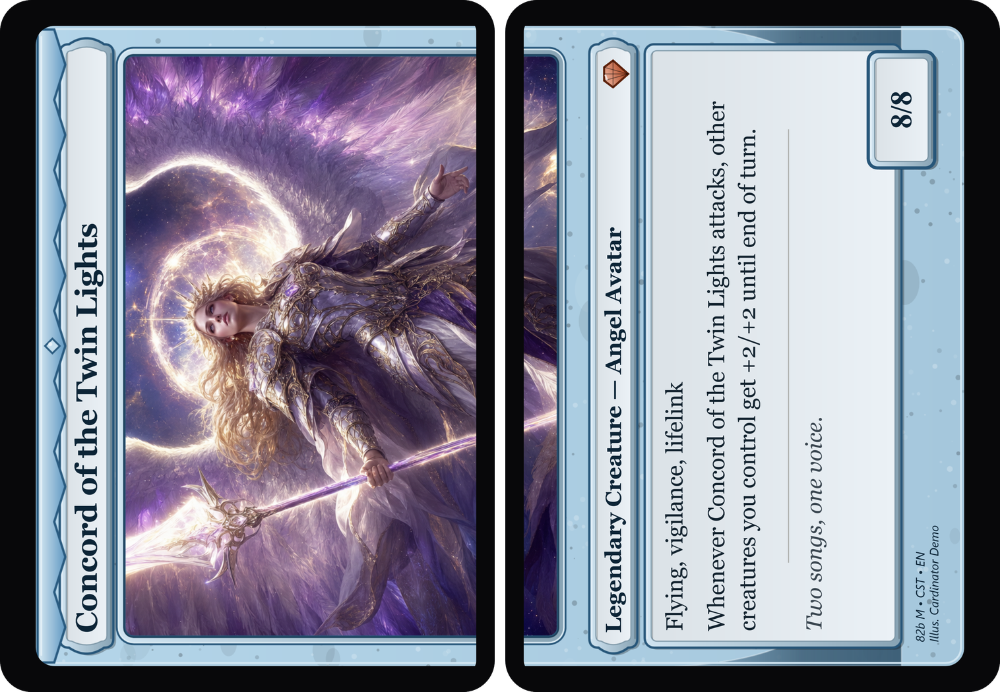
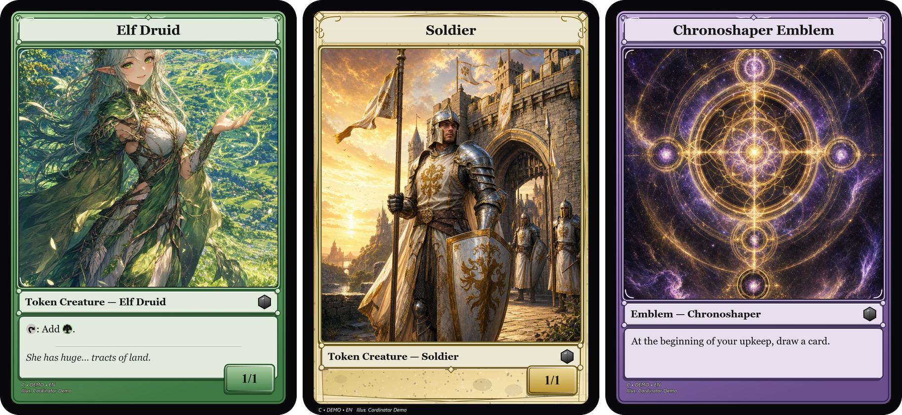

# Cardinator — User Guide

A friendly walkthrough for making cards. If you just want the short version, see the
[README](../README.md).

---

## 1. Getting started

1. Put `Cardinator.exe` anywhere you like (a folder on your Desktop is fine) and double-click it.
2. The first time it runs, it creates a **`CardinatorData`** folder right next to the exe. That's
   where it keeps templates, downloaded mana symbols, your saved projects, and exported cards.
   You can move the exe + that folder together to another PC and everything comes with it. (If the exe's
   folder can't be written to — say it's under *Program Files* — the folder goes in
   `%APPDATA%\Cardinator` instead, and failing that in your temp folder.)

There's nothing to install and no runtime to download — it's a single self-contained program.

---

## 2. Make one card (the common case)

The main screen is built around the everyday flow: **look up a card, swap in your own art,
export.**

*Left: your cards + batch tools. Middle: the editor (name, frame, artwork, export). Right:
the live preview that updates as you type.*

1. **Name your card.** The **CARD NAME** box is just your card's title — type whatever you like.
2. **Pick a frame** from the **Frame** dropdown (on its own row so long names aren't clipped), with
   **Design…**, **Import…**, **Export…** and **Delete…** beneath it. Choose **Full Art** for a card
   whose text sits directly on the artwork. Click **Design…** to open the frame designer — mix and
   match the frame's style, connected panels, textured background, bottom taper, top emblem, royal
   sub-border, border thickness and colors, all with a **live preview** (and **Save as new…** to keep
   the original). Have your own frame image? Click **Import…** — see
   [Making your own frames](TEMPLATES.md). Each card remembers its own frame, so a set can mix frames.
3. **Add your art.** Three easy ways:
   - **Change art…** to browse for an image file, or
   - **Paste** — copy an image (including one copied from a web browser), an image file, or an image
     URL, and click Paste, or
   - **Drag an image file straight onto the window.**
4. **Position the art.** Drag on the preview to **pan**, scroll to **zoom** (hold **Ctrl** for fine
   zoom). Click the preview, then nudge with the **arrow keys** (hold **Shift** for 10px steps) and
   zoom with **+ / -**; the hint under the preview says when the keys are on. **Reset** (next to
   **Clear**), or **0** on the preview, puts the art back centred at its original size — undoable with
   **Ctrl+Z**. (The Art zoom / Pan sliders in **Edit details…** work too.)
5. **Tweak anything** by hand in **Edit details…** — every field is editable, so you can change
   the rules text, add flavor text, set rarity, artist, etc. — or make a completely original card
   with no Scryfall lookup at all.

   

   **Borrow a real card's stats:** inside **Edit details…**, use **Fill from Scryfall** — type any
   real card name and it fills the mana cost, type, rules text, power/toughness and printing info,
   while leaving your card's **name, art and frame untouched**. (So "Boogie Woogie" can have Lightning
   Bolt's stats.) Tick **Also use its art** to take the looked-up card's Scryfall art as well (Cancel
   puts yours back). *(No internet? Just type the fields yourself.)* **Ctrl+L** still does a quick
   look-up of the selected card by its own name, and takes its name — and its art, if the card has none
   yet (art you've already added is never replaced).
6. **Export PNG…** saves a print-quality **1500×2100** image — pick **PNG or JPEG** in the save
   dialog. It's tagged **600 DPI**, so it prints at real card size (2.5″×3.5″).
   Phone photos used as art come out the right way up. Exports default to your set's `out` folder (or wherever you last saved one), and **Open
   output folder** opens that same place. Or click **Copy image** to drop the finished card straight
   onto your clipboard for pasting into Discord/chat. For print services that need a **bleed margin**
   or a specific **DPI**, use the `--render` command-line options (see the
   [command-line reference](CLI.md)); there's also a **card back** for double-sided printing
   (`--cardback`).

> **Mana symbols** use the real Scryfall artwork. The first time you use a symbol it's downloaded
> and cached; after that it works offline. Before it's cached (or with no internet), Cardinator
> draws clean colored pips instead, so nothing ever breaks. You can also use a **custom set-symbol
> image** — for the whole set in **Set defaults…**, or for the cards you select with **Set fields on all…**.
> It's drawn in its own proportions, where the rarity pip goes.

> **The CHECKS panel** (in the editing column, just above **Export PNG…**) watches the selected card as you
> edit and flags problems before you export — an unrecognized `{symbol}`, a footer overlapping the text box,
> a region that falls outside the card, rules text too long for its box, or a collector number used by more
> than one card. It also looks at the **rendered pixels**, so it even catches art that's assigned but came out
> **blank** (a moved or corrupt image file). Lighter **notes** (ℹ) point out things that may be on purpose —
> no art yet, two cards with the same name. "✓ No issues" means you're clear.

> **Undo/redo:** every edit is undoable — use the header **Undo** / **Redo** buttons or **Ctrl+Z** /
> **Ctrl+Y** (**Ctrl+Shift+Z** also redoes).

---

## 3. Writing mana and rules text

- **Mana cost** uses Scryfall's `{...}` tokens: `{2}{R}{W}`, `{X}`, `{T}` (tap), `{C}`
  (colorless), hybrids like `{R/W}`, Phyrexian like `{U/P}`. You can also type it loosely —
  `2RW` becomes `{2}{R}{W}` automatically.
- **Rules text** understands the same `{...}` symbols *inline* — e.g. `{T}, Sacrifice a creature:
  draw a card.` Press **Enter** to start a new ability on its own line. Long text automatically
  shrinks to fit the box.
- **Flavor text** shows in italics under a divider line.

### Special card types

Cardinator recognizes these automatically from the type line / fields and lays them out for you:

| Type | How to trigger it | What you get |
|------|-------------------|--------------|
| **Planeswalker** | Type line contains "Planeswalker", set **Loyalty** | Loyalty box + one badge per ability line (`+2:`, `-3:`, `-8:`) |
| **Saga** | Type line contains "Saga" | Chapter badges (`I`, `II`, `III`) beside each chapter |
| **Class** | Type line contains "Class" | Level badges beside each level's abilities |
| **Adventure** | Fill the **Adventure** fields (or import an adventure card) | A storybook text box: the spell on the left page, the creature's rules on the right |
| **Double-faced** | Look up a real DFC, or **Make double-faced** | One card with a **front + back face** you can flip |
| **Battle** | Type line contains "Battle" (e.g. *Battle — Siege*), set **Defense** | **Sideways** card + a defense shield bottom-right |
| **Plane / Phenomenon** | Type line contains "Plane" or "Phenomenon" | **Sideways** card (Planechase) |
| **Flip card** | Look up a real flip card, or **Make flip card** | Two halves on one face: the other half **upside down** below the art |
| **Split card** | Look up a real split card or Room, or **Make split card** | Two small cards **side by side**, read with the card turned sideways |
| **Level up** | Rules with lines like `LEVEL 2-6`, then `3/3`, then that level's rules | Text box split into **level bands**, each with a LEVEL badge and its own P/T box |
| **Station** | Rules with lines like `3+ \| Flying` (Spacecraft, Planets) | Text box split into **threshold bands** with a `3+` badge; the P/T box sits on the band where it becomes a creature |
| **Case** | Rules with `To solve — …` and `Solved — …` lines | The opening ability, then a **To solve** band (magnifying glass) and a **Solved** band (check mark) |
| **Prototype** | First rules line like `Prototype {2}{R} — 3/2 (…)` | A band across the top of the text box in the prototype's colour, with its own cost and P/T |
| **Mutate** | First rules line like `Mutate {1}{G}{G} (…)` | The mutate line in a shaded band across the top of the text box |
| **Meld** | **Make meld card** (MELD section), or look up a meld card | Two double-faced cards whose backs, side by side, make one big melded card |
| **Aftermath** | A split card whose other half's rules start with **Aftermath** | First half **upright across the top**, the other half **sideways** below it |
| **Token / Emblem** | Type line starts with "Token" or "Emblem" (*Token Creature — Soldier*, *Emblem — Elspeth*), or **Add token** | **Tall art**, the name centred, a text box that fits its rules — **none** on a vanilla token |

**Double-faced cards (DFC).** A card can have a **back face** — a front/back card that flips. Looking up a real
double-faced card imports it as **one card with both faces**, whether you use **Ctrl+L**, a deck/CSV import or
the search inside **Edit details…**. (A **split** card like *Fire // Ice* is printed on one side, so it comes
in as one split card — see below — not a double-faced one.) To build one yourself, click **Make double-faced**
(under the editor), then **Edit back face…** to fill the back's fields and art, and **Show back** to flip the
preview. The style dropdown adds a corner indicator — **Flip arrow**, or **Sun / moon** (sun on the front,
crescent moon on the back) — drawn by Cardinator (no third-party art). Exporting writes both sides
(`Name.png` + `Name-back.png`); **Print sheet** puts the real back behind each front for double-sided printing.

**Sideways (landscape) cards.** Battles, Planes and Phenomena are printed sideways, and Cardinator turns them
**automatically** — no setting to find. Every drawn frame works: pick *Crimson Red* and a Battle comes out as a
sideways Crimson Red card, with the same colours, fonts and style laid out for the wider shape. A Battle's
**Defense** goes in **Edit details…** (next to Loyalty) and is drawn in a shield in the corner — its own field,
so a Battle never picks up planeswalker ability badges. A real Battle looked up from Scryfall arrives as one
card: a **sideways front** and its **upright transformed back** (use **Show back** to flip). To force any card
either way, use **Orientation** in **Edit details…** (*Automatic*, *Portrait*, or *Landscape*).

Exports come out sideways (2100 × 1500). On a **Print sheet** a sideways card is turned upright into a normal
card slot — it's the same physical card size — and on a double-sided sheet its transformed back lands right
behind it. *Imported* frames (a frame image you brought in) are fixed pictures that can't be turned; CHECKS tells
you when a sideways card is on one, and importing a frame image that is **wider than tall** makes a sideways
template to match.

**Flip cards.** A Kamigawa-style flip card (*Erayo, Soratami Ascendant*, *Bushi Tenderfoot*) is one card with
two halves on the **same** side: the top half reads upright — name, rules, then the type line with power/toughness
at its end — the art fills the middle, and the other half is printed **upside down** below it, for when the card
flips. Looking up a real flip card brings both halves as **one card**. To make one yourself, click **Make flip
card** (under the editor), then **Edit flipped half…** for the upside-down half's name, type, rules and P/T (it has
no mana cost, like the real ones), and **Show flipped** to turn the preview over and read it. Both halves share the
card's art, set and credits.

Every drawn frame lays itself out as a flip card automatically. The three *Partial Cardboard Chemist* frames
come with their own flip and sideways versions, so they work too. Any other *imported* frame image is a fixed
picture: CHECKS warns that only the upright half can show, and the card prints as a normal card until you pick a
frame that has a flip layout. A flip card prints on **one** side — no back, one slot on a print sheet.

**Split cards.** A split card (*Wear // Tear*, *Fire // Ice*, and Duskmourn's **Rooms**) has two halves side by side
on one face, each a small card of its own — name, mana cost, art, type line and rules — read with the card
turned sideways: the first half is on the left (the bottom of the upright card), the other half on the right, and
the card's credits run along its bottom edge. Looking up a real one brings both halves as **one card**, and
Scryfall's art (both halves' pictures side by side) is cut so each half gets its own. To make one yourself, click
**Make split card**, then **Edit other half…** for the second half. **Click a half in the preview** to choose which
half **Change art…**, paste, drag-to-move and scroll-to-zoom work on (or drop an image straight onto a half), and
**Read sideways** turns the preview so you can read it.

A reminder both halves end with — **Fuse** (*"You may cast one or both halves…"*) or a Room's *"(You may cast either
half…)"* — is printed **once**, in a bar across both halves, each end in its half's colour (red under *Wear*, white
under *Tear*). Every frame works, drawn or imported: each half is the frame's own card, just smaller. A split card
prints on one side, like a flip card.

**A frame for each half.** The card's frame is the first half's. To give the other half a frame of its own (a red
frame for *Wear* and a white one for *Tear*), pick it in **Other half's frame** under FLIP / SPLIT CARD; **Same as
the card** puts it back. It works for aftermath cards too, and with any frame, including imported picture frames.
**Share set + frames** takes the other half's frame along, and CHECKS says if it isn't installed (the half is then
drawn with the card's frame).

**Adventures.** An adventure card (*Bonecrusher Giant*) opens its text box like a book, the way cards have since
*Wilds of Eldraine*: the adventure spell is on the **left page** — a name bar in the spell's colour with its cost,
its type line, then its rules — and the creature's rules and flavor are on the **right page**, wrapping above the
P/T box. Both pages use the same rules size, so the spell reads as easily as the creature. Fill the **Adventure**
fields in **Edit details…** (or look an adventure card up) and it's drawn this way on every frame.

**Level up.** A leveler (*Student of Warfare*) lists its levels the way Scryfall writes them — a line
`LEVEL 2-6`, then that level's power/toughness on its own line (`3/3`), then its rules, and so on up to `LEVEL 7+`.
Cardinator splits the text box into **bands**: the first holds the *Level up* text with the card's own P/T, and each
level gets an arrow-shaped LEVEL badge on the left and its own P/T box on the right (so there's no P/T box in the
corner). Looked-up levelers come in ready; CHECKS points out a "Level up" card whose levels aren't written that way.

**Station and Case.** A Station card (*Uthros Research Craft*, Edge of Eternities Spacecraft and Planets) lists its
thresholds the way Scryfall writes them: `3+ | Whenever you cast…`, `12+ | Flying`. Each threshold gets a band with
its number in a badge, and everything after a threshold line belongs to that band. The P/T box sits on the band where
it becomes a creature (the reminder text's "artifact creature at 12+"), not in the corner. A Case (*Case of the
Burning Masks*) keeps its opening ability at the top, then a **To solve** band with a magnifying glass and a
**Solved** band with a check mark. Both work on every frame, and on frames with a medallion set into the bottom of
the text box (the *Partial Cardboard Chemist* ones) the bottom band's text stays above it. Looked-up cards come in
ready; CHECKS points out a Station card whose thresholds aren't written that way.

**Prototype and Mutate.** A prototype (*Blitz Automaton*) or mutate card (*Gemrazer*) is written the way Scryfall
writes it: its rules' **first line** is `Prototype {2}{R} — 3/2 (reminder…)` or `Mutate {1}{G}{G} (reminder…)`.
That line becomes a band across the top of the text box and the rest of the rules flow below. A prototype's band
takes the colour of the prototype cost (red for `{2}{R}`, gold for two colours, grey for colourless) and shows that
smaller cost and P/T at its right end; the card's own cost and P/T stay where they always are. Looked-up cards come in
ready.

**Aftermath cards.** An aftermath card (*Destined // Lead*, Amonkhet) is a split card arranged differently: the
first half reads **upright across the top** — in the frame's wide, sideways layout — and the other half sits
below it **turned sideways**, its title along the card's right edge (turn the card counter-clockwise to read it).
Cardinator spots one by its keyword: a split card whose other half's rules start with **Aftermath**. Looking one
up gets this automatically (with each half's art cut from Scryfall's picture); to make one yourself, make a split
card and begin the other half's rules with *"Aftermath (Cast this spell only from your graveyard. Then exile it.)"*.
**Read sideways** turns the preview the right way to read the sideways half. The drawn frames make the wide layout
themselves and the *Partial Cardboard Chemist* frames bring their sideways versions; another imported picture
frame without one shows its normal upright picture in the top half.

**Meld.** A meld pair (*Bruna, the Fading Light* and *Gisela, the Broken Blade*) are two double-faced cards whose
**backs are the two halves of one big card** (*Brisela, Voice of Nightmares*): put the two cards side by side, turn
them a quarter clockwise, and the melded card reads across both. In Cardinator each part is a double-faced card whose
**back face is the melded card**; the back prints only its half. The **MELD** section has the controls:
**Make meld card** (its back becomes the melded card — edit it with **Edit back face…**), **Add meld partner** (adds
the other card, its back printing the other half of the same melded card), **Back: top half / bottom half** (which
half this card's back prints; the partner gets the other), and **Show melded card** (preview the whole melded card,
or this card's half as printed). Edits to the melded card through either part — its text, art, pan and zoom — reach
both. Looking up a meld card brings its melded card along and picks the right half; the status line names the
partner to add. The fronts show a meld icon. Exports and print sheets give each part its own back, so printing
double-sided just works: the top-half card goes on the left. A CSV import can make meld cards too, with the
`meld_name`, `meld_half`, `meld_with` and `meld_type`/`meld_rules`/`meld_pt`/`meld_art` columns (see the
[column reference](../examples/02-custom-set/README.md)); two rows with the same `meld_name` are partners.

**Tokens and emblems.** Write the type line the way Scryfall does — *Token Creature — Soldier*, *Token
Artifact — Treasure*, *Emblem — Elspeth* — and the card gets its frame's **token layout**: the art runs much
further down the card, the name is centred in the title bar (when there's no mana cost), and the text box is
just big enough for its rules. A **vanilla** token (no rules, like a 1/1 Soldier) has **no text box** at all: the
type line sits on the P/T box. **Add token** (under CARDS) starts one. Tokens are ordinary cards in your set, so
**Export all** and **Print sheet** do them with everything else — make the tokens your set creates and print
them in one go. Looking up a real token works too (e.g. *Goblin // Soldier*), and **Scryfall search…** (BATCH)
with `t:token` (add a name or type, e.g. `t:token t:spirit`) brings in a batch. Every frame has a token layout:
built-in frames are redrawn for it, and picture frames (the alchemy samples, imported ones) are rearranged —
their art window stretched down and their text box shortened — keeping their own borders and medallion
(they keep a small box even on a vanilla token, since the box is part of their picture). A CSV row is a token
the same way: put the "Token …" type line in its `type` column. [Example 05](../examples/05-tokens-emblems/) is nine tokens on one print sheet.

**Authoring them by hand:** open **Edit details…** and use the **Special layouts** section to set a
**Subtitle** (a small plate under the title, on any card), the **Adventure** half (name/cost/type/text —
filling the name turns on the storybook text box), or a land's **big mana symbols** (`{R}{G}`) and how they're
arranged (`row`, `splitv`, `splith`, `pie`, `yinyang`). Planeswalker/Saga/Class still come from the type
line + rules-text syntax. Everything in Edit details… can be backed out with **Cancel**.

See the [gallery in the README](../README.md#gallery) for examples of each.

---

## 4. Making many cards at once

Cardinator always works on a **project** — the list of cards down the left side. Build it up card
by card, or import a whole batch.

- **Import file…** — load a file of cards. It accepts:
  - a plain **list of names**, one per line (each looked up on Scryfall) — a deck list works too:
    quantities (`4 Lightning Bolt`), printing hints (`Sol Ring (CMR) 472`; a lowercase code like `(cmr)` counts
    only with a number after it, so `Goblin King (alt)` keeps its name) and section
    headings (`Sideboard:`, `Creatures (25)`) are understood;
  - `Name | C:\art\thing.png` per line (name + art);
  - a **CSV/TSV with a header row**, columns matched by friendly names in any order. See the
    [example CSV](../examples/02-custom-set/cards.csv) and the [column reference](#csv-columns) below.
  - If any lines can't be read they're counted in the status, and if some card names are **already in
    your project** you're asked whether to **skip the duplicates** or add them anyway.
- **Import deck…** — paste a **Moxfield deck URL** (or the deck's exported text) and Cardinator pulls
  the whole decklist in, quantities and all.
- **Scryfall search…** — type a Scryfall query (e.g. `t:dragon c:r`, `set:dom`) and Cardinator lists up
  to 60 matching cards; tick the ones you want and **Add** brings them in **with their real art** — a fast
  way to build a themed set. (Also on the command line via `--search`.)
- **Add art from folder…** — point it at a folder of images and it attaches them to cards by
  matching the filename to the card name (`serra angel.png` → "Serra Angel"). Only fills cards
  that don't already have art. Exact filename matches are used silently; any **best-guess** (fuzzy)
  matches are listed afterwards so you can review the ones it wasn't sure about.
- **Fill blanks from Scryfall** — fills any card that still has only a name.
- **Number cards** — assigns collector numbers in list order, zero-padded to the set's size: `1/9` … `9/9`
  for a set of 9, `01/12` … `12/12` for 12, `001/120` … for 120 — so a whole set is numbered in one click.
- **Set defaults…** — the set's **house defaults** (set code, rarity, copyright, artist, set-symbol image,
  and default frame). Every **new or imported** card inherits these for any field it doesn't already have, so
  you set them once instead of per card. Tick **Also apply to cards already in the set** to fill blanks on the cards
  you already have. Defaults are saved with the project.
- **Set fields on all…** — a bulk editor: set the **set code, artist, rarity, copyright, frame** and
  a **custom set-symbol image** on every card at once (leave a field blank to keep each card's own). If you
  **multi-select** cards in the list first, it asks whether to apply to just those or the whole set. A new
  frame goes on each card's back face too, unless that back face has a frame of its own.
- **Check all cards** — runs the CHECKS across the whole set and lists every card that needs attention
  (missing art/frame, bad symbol, duplicate/stale number, broken special layout…), then jumps to the first.
- **Share set + frames…** — zips the whole set (project + `art/` + a bundle for each custom frame the
  cards use, with its flip and sideways layouts) so you can hand it to someone who doesn't have your
  frames. The set must have been saved once; any unsaved changes, it offers to save first.
- **Move ↑ / ↓** — reorder the selected card in the list (this is also the print/collector order).
- **Duplicate** (**Ctrl+D**) — copy the selected card (the sidebar button next to Add token).
- **Export all…** — renders every card to PNGs (600 DPI, real card size) in a folder you choose. Runs
  in the background with a progress bar so the window stays responsive, even for 100 cards.
- **Print sheet…** — lays cards out **9 per page (3×3) at real size (2.5″×3.5″, 300 DPI)** on
  Letter pages with cut marks — one PNG per page, ready to print and cut. (A4 pages are on the command line:
  `--sheet … a4`.) It first asks
  whether to include **card backs** for double-sided printing: **Front + back** writes a mirrored back
  page after each front page (flip on the long edge), **Fronts only** writes just the fronts.

Editing is fully **undoable** (**Ctrl+Z** / **Ctrl+Y**, or the header Undo/Redo buttons), across the
whole project. Use **New / Open / Save** in the top-right to manage projects.

**Saving a set.** When you **Save**, Cardinator writes a **set folder**: the `.cardinator` project file
plus an `art/` subfolder (your images are copied in) and an `out/` subfolder (where Export and Print
sheet default). So the first time, **make a new, empty folder for the set** in the Save dialog (its *New
folder* button) — saving straight into Documents or the Desktop puts `art/` and `out/` there too (Cardinator
warns if the folder already holds another set). The whole folder is self-contained — **move, zip or share it** and every card still
finds its art, because art is stored as a path relative to the folder. A one-off single card needs no
setup: the folder is only created the first time you save. (Older single-file projects still open fine.)

**Your work is protected four ways.** (1) Saves are **atomic** — a crash or full disk mid-save can never
truncate a good file. (2) Every save first tucks the previous version into a **`backups/`** folder (the last
15, plus the first of each of the last 30 days, so a burst of saves can't flush older history; saving an
unchanged set adds no copy); click **Restore…** (top-right) to roll back to an earlier one if a save or an update ever
goes wrong. Restoring loads that older version with its art intact and keeps pointing at your real project
file, so a single **Save** puts it back in place (and backs up the bad version first). (3) If a project file
is ever unreadable, Cardinator preserves it as a `.corrupt-backup` instead of losing it. (4) While a set has
unsaved changes, a **recovery copy** is kept every minute, and again if Windows logs off, shuts down or restarts
for an update (none of which ask to save). If Cardinator never got to save, the next launch offers to open the
recovered copy; **Save** then puts it back over your set. And every new version is built to **open files from
every older version**.

Opening a backup file directly (**Open** or a drop) works the same as **Restore…**: **Save** writes it back
over the set's own file, never into `backups/`. And **Open** only opens sets — a card or frame `.json` is
refused rather than opened as an empty set you might save over it.

Double-faced cards are covered by all of this too: the **back face's art travels with the set** exactly like
the front's, so a moved, zipped or shared folder still renders both sides.

### CSV columns

The first row names the columns, in any order, matched without caring about case, spaces or
punctuation (`Mana Cost`, `mana_cost` and `manacost` are the same). Commas, semicolons (what Excel
writes in many European languages) or tabs all work, and a file saved by Excel's plain **CSV** option
keeps its accents and curly quotes. Only `name` is required; a row with no cost, type or rules is looked
up on Scryfall. Costs can be typed loosely — `2RW`, `W/U` (hybrid), `G/P` (Phyrexian) all become symbols. Write a line break in rules or flavor as `\n`, or inside a quoted field (as Excel does).

| Column | Also accepted | What it holds |
|---|---|---|
| `name` | card, card name, title | The card's name |
| `art` | image, art path, picture, artwork, file, img | Art file, relative to the CSV (or absolute) |
| `mana` | mana cost, cost | `{2}{R}` |
| `type` | type line, types | `Creature — Elf`; start it with **Token** or **Emblem** for a token |
| `rules` | text, rules text, oracle, oracle text, ability, abilities | Rules text (`\n` = new line) |
| `flavor` | flavour, flavor text | Flavor text |
| `pt` | power toughness | `3/3` — or separate `power` (pow) and `toughness` (tough, tou) |
| `loyalty` | loy | Planeswalker loyalty |
| `defense` | defence, def | Battle defense |
| `orientation` | | `landscape` to draw the card sideways |
| `template` | frame, border, color, colour | Frame name (blank = the set's house frame) |
| `set` | set code, expansion | Set code |
| `collector` | collector number, number, num | Collector number |
| `rarity` | | `C`, `U`, `R` or `M` |
| `artist` | illustrator, illus | Artist credit |
| `copyright` | copy | Copyright line |
| `lookup` | scryfall, fetch | `yes` / `no`: force or skip the Scryfall lookup |
| `qty` | quantity, count, copies, amount | How many copies of the row (`4` or `4x`); blank = 1 |

Special layouts add their own columns (any one of them makes the row that kind of card):
**flip** `flip_name`, `flip_type`, `flip_rules`, `flip_power`, `flip_toughness` / `flip_pt`;
**split** `split_name`, `split_cost`, `split_type`, `split_rules`, `split_flavor`, `split_art`, `split_frame`;
**meld** `meld_name`, `meld_half` (`top`/`bottom`), `meld_with`, `meld_cost`, `meld_type`, `meld_rules`,
`meld_flavor`, `meld_pt` (or `meld_power`/`meld_toughness`), `meld_art`.
[Example 02](../examples/02-custom-set/) explains how flip, split and meld rows work.

---

## 5. Keyboard shortcuts & drag-and-drop

| Shortcut | Action |
|----------|--------|
| **F1** | Open the built-in **Help** cheat sheet (also the **Help** button, top-right) |
| **Ctrl+N** | New project |
| **Ctrl+O** | Open project |
| **Ctrl+S** | Save (re-saves to the same file after the first save) |
| **Ctrl+L** | Look up the current card on Scryfall |
| **Ctrl+E** | Export the current card |
| **Ctrl+D** | Duplicate the current card |
| **Ctrl+Z** | Undo the last edit |
| **Ctrl+Y** | Redo (also **Ctrl+Shift+Z**) |

**Drop files onto the window:**
- an **image** → sets the current card's art;
- a **`.cardinator` / `.json`** → opens that project;
- a **`.txt` / `.csv` / `.tsv`** → imports that card list.

Press **F1** (or the **Help** button) any time for the built-in cheat sheet:

Cardinator marks the title bar with a **●** when you have unsaved changes, and asks before you
close or open something else over unsaved work.

---

## 6. Troubleshooting

- **"Couldn't reach Scryfall" / "timed out."** You're offline or Scryfall is unreachable. You can
  still make cards by typing the fields yourself; symbols fall back to drawn pips.
- **"No card found."** Check the spelling — lookup is fuzzy but needs to be close.
- **A card renders blank in the art window.** The art file was moved or deleted. Re-attach it with
  **Change art…**. Cardinator never crashes on missing art — it just shows the empty window.
- **"Couldn't open project" — the file may be corrupt.** Cardinator saves a copy next to it named
  `<yourproject>.cardinator.corrupt-backup` so nothing is lost; you can inspect or send that file.
- **"Saved by a newer Cardinator."** The set opens normally, but it was written by a newer version, so
  anything this version doesn't understand won't be kept if you save over it. Update Cardinator first if
  you want to keep everything (and note every save still leaves a copy in `backups/`).
- **I restored a backup — will I lose my art or overwrite the wrong file?** No. A restored backup keeps
  its art links (they resolve against the set folder, not the `backups/` folder), and **Save** writes back
  over the project you restored from — no Save-As, no second copy in the wrong place. If the backup itself
  turns out to be unreadable, the project you already had open is left exactly as it was.
- **A frame disappeared from the dropdown.** If a frame image can't be read (a bad copy, a sync
  conflict), Cardinator sets it aside as `frame.png.corrupt-<date>` in that template's folder and skips
  the frame rather than replacing your image with a generic one — the original bytes are still there.
- **I want a different frame.** Add your own — see [Making your own frames](TEMPLATES.md).
- **Where did my export go?** Click **Open output folder**, or look in `CardinatorData/output`.
