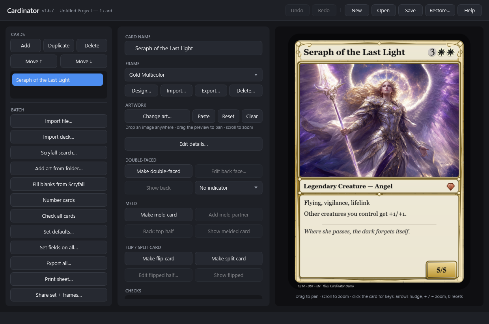
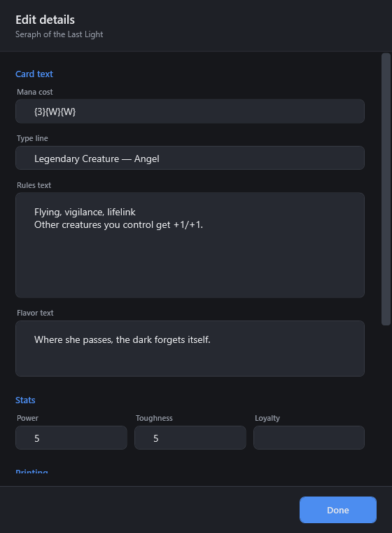
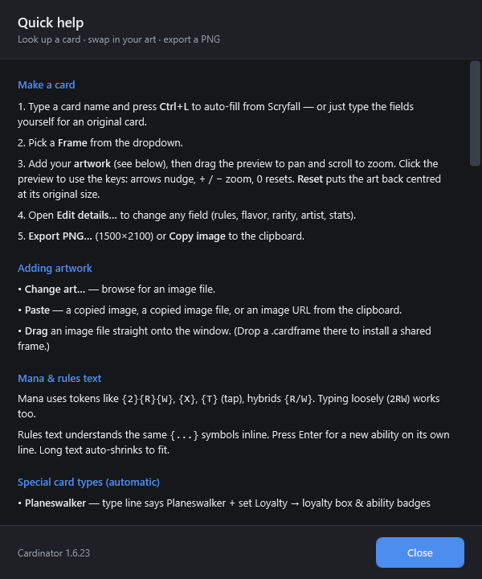

# Cardinator — User Guide

A friendly walkthrough for making cards. If you just want the short version, see the
[README](../README.md).

---

## 1. Getting started

1. Put `Cardinator.exe` anywhere you like (a folder on your Desktop is fine) and double-click it.
2. The first time it runs, it creates a **`CardinatorData`** folder right next to the exe. That's
   where it keeps templates, downloaded mana symbols, your saved projects, and exported cards.
   You can move the exe + that folder together to another PC and everything comes with it.

There's nothing to install and no runtime to download — it's a single self-contained program.

---

## 2. Make one card (the common case)

The main screen is built around the everyday flow: **look up a card, swap in your own art,
export.**

*Left: your cards + batch tools. Middle: the editor (name, frame, artwork, export). Right:
the live preview that updates as you type.*

1. **Name your card.** The **CARD NAME** box is just your card's title — type whatever you like.
2. **Pick a frame** from the **Frame** dropdown (on its own row so long names aren't clipped), with
   **Design…**, **Import…**, **Export…** and **Delete…** beneath it. Choose **Full Art** for a card
   whose text sits directly on the artwork. Click **Design…** to open the frame designer — mix and
   match the frame's style, connected panels, textured background, bottom taper, top emblem, royal
   sub-border, border thickness and colors, all with a **live preview** (and **Save as new…** to keep
   the original). Have your own frame image? Click **Import…** — see
   [Making your own frames](TEMPLATES.md). Each card remembers its own frame, so a set can mix frames.
3. **Add your art.** Three easy ways:
   - **Change art…** to browse for an image file, or
   - **Paste** — copy an image (including one copied from a web browser), an image file, or an image
     URL, and click Paste, or
   - **Drag an image file straight onto the window.**
4. **Position the art.** Drag on the preview to **pan**, scroll to **zoom** (hold **Ctrl** for fine
   zoom). Click the preview, then nudge with the **arrow keys** (hold **Shift** for 10px steps) and
   zoom with **+ / -**. (The Art zoom / Pan sliders in **Edit details…** work too.)
5. **Tweak anything** by hand in **Edit details…** — every field is editable, so you can change
   the rules text, add flavor text, set rarity, artist, etc. — or make a completely original card
   with no Scryfall lookup at all.

   

   **Borrow a real card's stats:** inside **Edit details…**, use **Fill from Scryfall** — type any
   real card name and it fills the mana cost, type, rules text, power/toughness and printing info,
   while leaving your card's **name, art and frame untouched**. (So "Boogie Woogie" can have Lightning
   Bolt's stats.) *(No internet? Just type the fields yourself.)* **Ctrl+L** still does a quick
   look-up of the selected card by its own name.
6. **Export PNG…** saves a print-quality **1500×2100** image — pick **PNG or JPEG** in the save
   dialog. Exports default to your set's `out` folder (or wherever you last saved one), and **Open
   output folder** opens that same place. Or click **Copy image** to drop the finished card straight
   onto your clipboard for pasting into Discord/chat. For print services that need a **bleed margin**
   or a specific **DPI**, use the `--render` command-line options (see the
   [command-line reference](CLI.md)); there's also a **card back** for double-sided printing
   (`--cardback`).

> **Mana symbols** use the real Scryfall artwork. The first time you use a symbol it's downloaded
> and cached; after that it works offline. Before it's cached (or with no internet), Cardinator
> draws clean colored pips instead, so nothing ever breaks. You can also point a card at a **custom
> set-symbol image** (in **Edit details…**, or across a whole set via **Set fields on all…**).

> **The CHECKS panel** below the preview watches the selected card as you edit and flags problems
> before you export — missing art, an unrecognized `{symbol}`, a footer overlapping the text box, a
> region that falls outside the card, or a collector number used by more than one card. It also looks at
> the **rendered pixels**, so it even catches art that's assigned but came out **blank** (a moved or
> corrupt image file). A green "✓ No issues" means you're clear.

> **Undo/redo:** every edit is undoable — use the header **Undo** / **Redo** buttons or **Ctrl+Z** /
> **Ctrl+Y** (**Ctrl+Shift+Z** also redoes).

---

## 3. Writing mana and rules text

- **Mana cost** uses Scryfall's `{...}` tokens: `{2}{R}{W}`, `{X}`, `{T}` (tap), `{C}`
  (colorless), hybrids like `{R/W}`, Phyrexian like `{U/P}`. You can also type it loosely —
  `2RW` becomes `{2}{R}{W}` automatically.
- **Rules text** understands the same `{...}` symbols *inline* — e.g. `{T}, Sacrifice a creature:
  draw a card.` Press **Enter** to start a new ability on its own line. Long text automatically
  shrinks to fit the box.
- **Flavor text** shows in italics under a divider line.

### Special card types

Cardinator recognizes these automatically from the type line / fields and lays them out for you:

| Type | How to trigger it | What you get |
|------|-------------------|--------------|
| **Planeswalker** | Type line contains "Planeswalker", set **Loyalty** | Loyalty box + one badge per ability line (`+2:`, `-3:`, `-8:`) |
| **Saga** | Type line contains "Saga" | Chapter badges (`I`, `II`, `III`) beside each chapter |
| **Class** | Type line contains "Class" | Level badges beside each level's abilities |
| **Adventure** | Fill the **Adventure** fields (or import an adventure card) | A spell sub-box on the creature |
| **Double-faced** | Look up a real DFC | Imported as two cards — front and back |

**Authoring them by hand:** open **Edit details…** and use the **Special layouts** section to set a
**Subtitle** (a small plate under the title, on any card), the **Adventure** half (name/cost/type/text —
filling the name turns on the adventure sub-box), or a land's **big mana symbols** (`{R}{G}`) and how they're
arranged (`row`, `splitv`, `splith`, `pie`, `yinyang`). Planeswalker/Saga/Class still come from the type
line + rules-text syntax. Everything in Edit details… can be backed out with **Cancel**.

See the [gallery in the README](../README.md#gallery) for examples of each.

---

## 4. Making many cards at once

Cardinator always works on a **project** — the list of cards down the left side. Build it up card
by card, or import a whole batch.

- **Import list / CSV…** — load a file of cards. It accepts:
  - a plain **list of names**, one per line (each looked up on Scryfall);
  - `Name | C:\art\thing.png` per line (name + art);
  - a **CSV/TSV with a header row**, columns matched by friendly names in any order. See the
    [example CSV](../examples/02-custom-set/cards.csv) and its [column reference](../examples/README.md).
  - If any lines can't be read they're counted in the status, and if some card names are **already in
    your project** you're asked whether to **skip the duplicates** or add them anyway.
- **Scryfall search…** — type a Scryfall query (e.g. `t:dragon c:r`, `set:dom`) and Cardinator
  imports up to 60 matching cards **with their real art** in one go — a fast way to build a themed
  set. (Also on the command line via `--search`.)
- **Match art folder…** — point it at a folder of images and it attaches them to cards by
  matching the filename to the card name (`serra angel.png` → "Serra Angel"). Only fills cards
  that don't already have art. Exact filename matches are used silently; any **best-guess** (fuzzy)
  matches are listed afterwards so you can review the ones it wasn't sure about.
- **Look up missing** — fills any card that still has only a name.
- **Number cards** — assigns collector numbers in list order — `001/N`, `002/N`, … (zero-padded to
  the total's width) — so a whole set is numbered in one click.
- **Set defaults…** — the set's **house defaults** (set code, rarity, copyright, artist, set-symbol image,
  and default frame). Every **new or imported** card inherits these for any field it doesn't already have, so
  you set them once instead of per card. Tick **Also apply to existing cards** to fill blanks on the cards
  you already have. Defaults are saved with the project.
- **Set fields on all…** — a bulk editor: set the **set code, artist, rarity, copyright, frame** and
  a **custom set-symbol image** on every card at once (leave a field blank to keep each card's own). If you
  **multi-select** cards in the list first, it asks whether to apply to just those or the whole set.
- **Check all cards** — runs the CHECKS across the whole set and lists every card that needs attention
  (missing art/frame, bad symbol, duplicate/stale number, broken special layout…), then jumps to the first.
- **Share set + frames…** — zips the whole set (project + `art/` + a bundle for each custom frame the
  cards use) so you can hand it to someone who doesn't have your frames (save the project first).
- **Move ↑ / ↓** — reorder the selected card in the list (this is also the print/collector order).
- **Copy** — duplicate the selected card (the sidebar button next to Add/Delete).
- **Export all…** — renders every card to PNGs in a folder you choose. Runs in the background
  with a progress bar so the window stays responsive, even for 100 cards.
- **Print sheet…** — lays cards out **9 per page (3×3) at real size (2.5″×3.5″, 300 DPI)** on
  Letter (or A4) pages with cut marks — one PNG per page, ready to print and cut. It first asks
  **Yes / No / Cancel** whether to include **card backs** for double-sided printing: **Yes** writes
  a mirrored back page after each front page (flip on the long edge), **No** writes fronts only.

Editing is fully **undoable** (**Ctrl+Z** / **Ctrl+Y**, or the header Undo/Redo buttons), across the
whole project. Use **New / Open / Save** in the top-right to manage projects.

**Saving a set.** When you **Save**, Cardinator writes a **set folder**: the `.cardinator` project file
plus an `art/` subfolder (your images are copied in) and an `out/` subfolder (where Export and Print
sheet default). The whole folder is self-contained — **move, zip or share it** and every card still
finds its art, because art is stored as a path relative to the folder. A one-off single card needs no
setup: the folder is only created the first time you save. (Older single-file projects still open fine.)

**Your work is protected three ways.** (1) Saves are **atomic** — a crash or full disk mid-save can never
truncate a good file. (2) Every save first tucks the previous version into a **`backups/`** folder (the last
15, timestamped); click **Restore…** (top-right) to roll back to an earlier one if a save or an update ever
goes wrong. (3) If a project file is ever unreadable, Cardinator preserves it as a `.corrupt-backup` instead
of losing it. And every new version is built to **open files from every older version**.

---

## 5. Keyboard shortcuts & drag-and-drop

| Shortcut | Action |
|----------|--------|
| **F1** | Open the built-in **Help** cheat sheet (also the **Help** button, top-right) |
| **Ctrl+N** | New project |
| **Ctrl+O** | Open project |
| **Ctrl+S** | Save (re-saves to the same file after the first save) |
| **Ctrl+L** | Look up the current card on Scryfall |
| **Ctrl+E** | Export the current card |
| **Ctrl+D** | Duplicate the current card |
| **Ctrl+Z** | Undo the last edit |
| **Ctrl+Y** | Redo (also **Ctrl+Shift+Z**) |

**Drop files onto the window:**
- an **image** → sets the current card's art;
- a **`.cardinator` / `.json`** → opens that project;
- a **`.txt` / `.csv` / `.tsv`** → imports that card list.

Press **F1** (or the **Help** button) any time for the built-in cheat sheet:

Cardinator marks the title bar with a **●** when you have unsaved changes, and asks before you
close or open something else over unsaved work.

---

## 6. Troubleshooting

- **"Couldn't reach Scryfall" / "timed out."** You're offline or Scryfall is unreachable. You can
  still make cards by typing the fields yourself; symbols fall back to drawn pips.
- **"No card found."** Check the spelling — lookup is fuzzy but needs to be close.
- **A card renders blank in the art window.** The art file was moved or deleted. Re-attach it with
  **Change art…**. Cardinator never crashes on missing art — it just shows the empty window.
- **"Couldn't open project" — the file may be corrupt.** Cardinator saves a copy next to it named
  `<yourproject>.cardinator.corrupt-backup` so nothing is lost; you can inspect or send that file.
- **I want a different frame.** Add your own — see [Making your own frames](TEMPLATES.md).
- **Where did my export go?** Click **Open output folder**, or look in `CardinatorData/output`.
