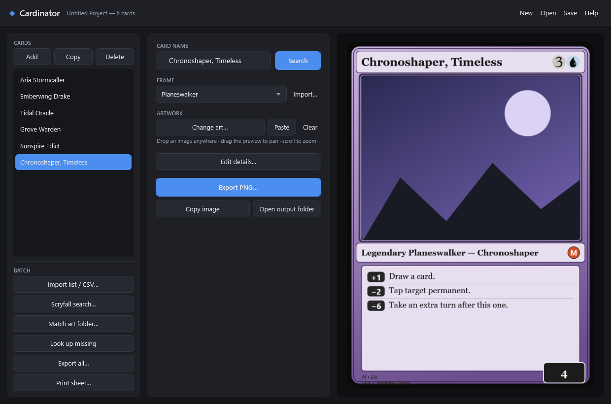
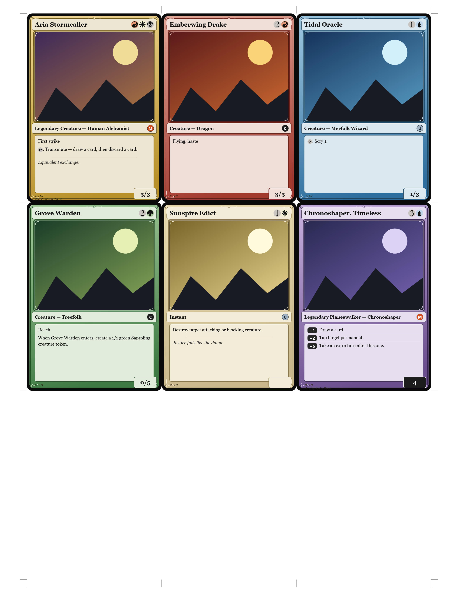
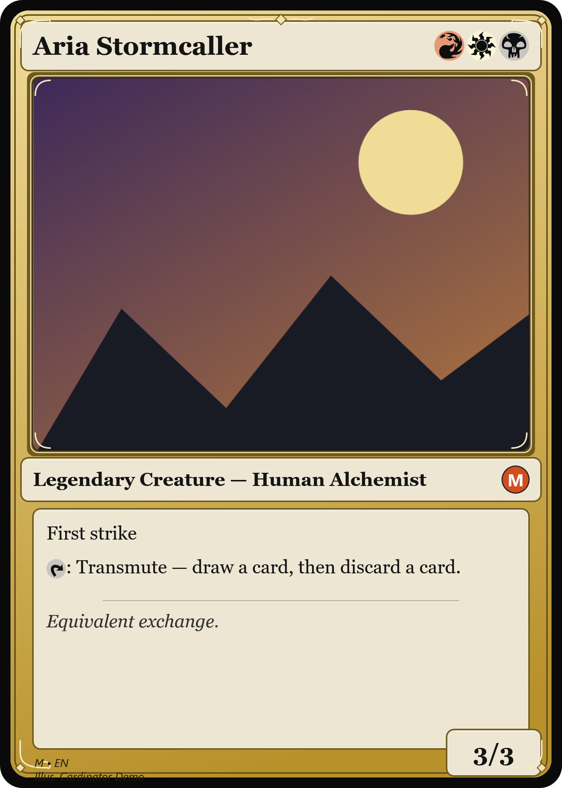
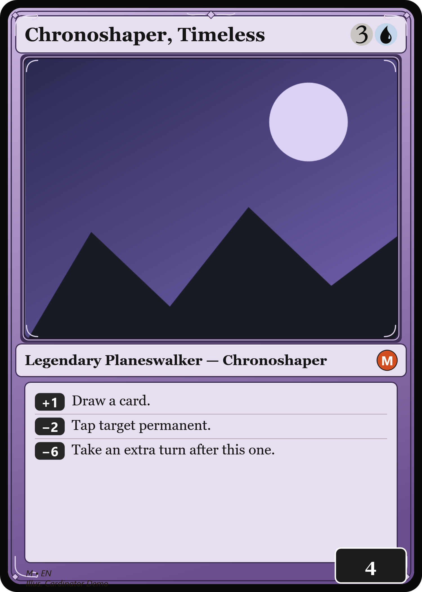

# Example 01 · Build a custom set from a spreadsheet

**The everyday flow: list the cards you want, point at your art, get a finished set + a print sheet.**

This set is six invented cards spanning different layouts (creatures, an instant, and a
planeswalker) on different frames — all original, all rendered from one CSV.

## What's here

```
02-custom-set/
  cards.csv          <- the set: one row per card
  art/               <- our placeholder artwork (swap in your own)
  output/            <- the rendered result (checked in)
```

## The input — `cards.csv`

One row per card. Blank cells are fine; `\n` makes a new line in rules text; `pt` is like `3/3`.

```csv
name,art,mana,type,rules,flavor,pt,loyalty,template,rarity,artist
Aria Stormcaller,art/aria.png,{R}{W}{B},Legendary Creature — Human Alchemist,"First strike\n{T}: Transmute — draw a card, then discard a card.",Equivalent exchange.,3/3,,Gold Multicolor,M,Cardinator Demo
Emberwing Drake,art/emberwing.png,{2}{R},Creature — Dragon,"Flying, haste",,3/3,,Crimson Red,C,
Tidal Oracle,art/tidal.png,{1}{U},Creature — Merfolk Wizard,{T}: Scry 1.,,1/3,,Ocean Blue,U,
Grove Warden,art/grove.png,{2}{G},Creature — Treefolk,"Reach\nWhen Grove Warden enters, create a 1/1 green Saproling creature token.",,0/5,,Forest Green,C,
Sunspire Edict,art/sunspire.png,{1}{W},Instant,Destroy target attacking or blocking creature.,Justice falls like the dawn.,,,Parchment,U,
"Chronoshaper, Timeless",art/chrono.png,{3}{U},Legendary Planeswalker — Chronoshaper,"+1: Draw a card.\n-2: Tap target permanent.\n-6: Take an extra turn after this one.",,,4,Planeswalker,M,Cardinator Demo
```

## In the app

Import list / CSV… → `cards.csv` loads the whole set. Here it is with the planeswalker selected —
note the loyalty box and ability badges laid out automatically:



## Run it

**App:** Import list / CSV… → `cards.csv`, then **Print sheet…** / **Export all…**

**Command line** (from the repo root):

```powershell
Cardinator.exe --batch examples/02-custom-set/cards.csv examples/02-custom-set/output examples/02-custom-set
Cardinator.exe --sheet examples/02-custom-set/cards.csv examples/02-custom-set/output examples/02-custom-set
```

## The output

A printable 3×3 sheet of the whole set (`output/sheet_page_01.png`):



Individual cards land in `output/` too — e.g. the multicolor legend and the planeswalker (note the
loyalty box and ability badges, laid out automatically from the `+1:` / `-2:` lines):

<p>
  
  
</p>
