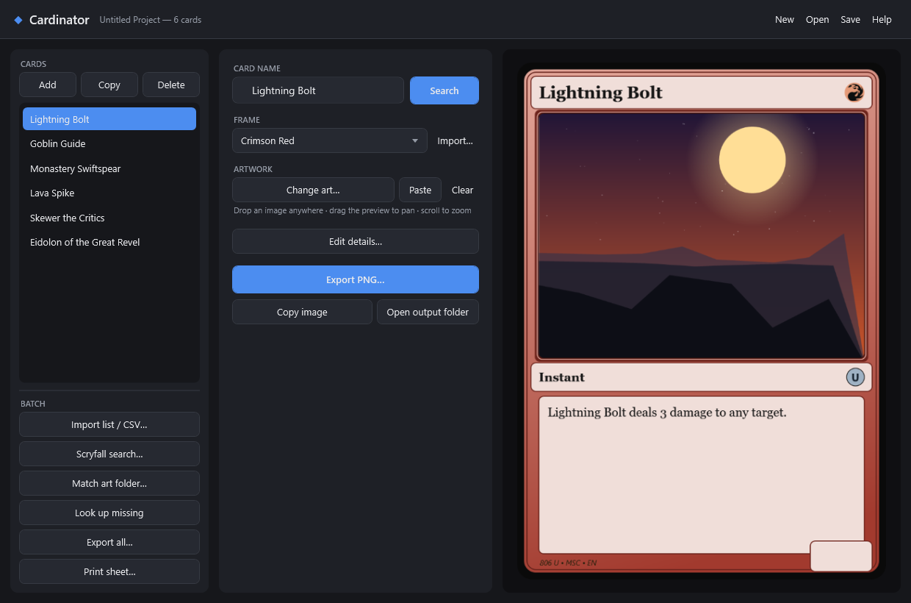

# Example 02 · Real Magic cards with your own custom art ⭐

**The headline use case.** You have a deck of **real Magic cards**, and you want the whole deck in
**your own custom artwork**. Give Cardinator a list of the real card names + your art files; it pulls
each card's real rules text and mana symbols from **Scryfall** and composites them onto your art.

This example is a mono-red aggro core — six real cards, each with our own art.

## What's here

```
02-proxy-deck/
  deck.csv           <- real card names + your art file + a frame
  art/               <- our custom artwork (swap in your own)
  output/            <- the rendered cards + print sheet + an app screenshot (checked in)
```

## The input — `deck.csv`

Just the name, your art file, and a frame. Everything else comes from Scryfall.

```csv
name,art,template
Lightning Bolt,art/bolt.png,Crimson Red
Goblin Guide,art/guide.png,Crimson Red
Monastery Swiftspear,art/swiftspear.png,Crimson Red
Lava Spike,art/spike.png,Crimson Red
Skewer the Critics,art/skewer.png,Crimson Red
Eidolon of the Great Revel,art/eidolon.png,Crimson Red
```

## Do it in the app

1. **Import list / CSV…** → pick `deck.csv`. Cardinator adds all six cards and looks each one up on
   Scryfall, filling in the real text and mana symbols. Your art (from the `art/` paths) loads with
   them. Here's the app with the deck loaded and *Lightning Bolt* selected — real text from Scryfall,
   your custom art in the preview:

   

2. **Print sheet…** (or **Export all…**) to render the whole deck.

Prefer the command line? From the repo root:

```powershell
Cardinator.exe --batch examples/02-proxy-deck/deck.csv examples/02-proxy-deck/output examples/02-proxy-deck
Cardinator.exe --sheet examples/02-proxy-deck/deck.csv examples/02-proxy-deck/output examples/02-proxy-deck
```

## The output

The finished deck — real cards, your art — on a printable 3×3 sheet (`output/sheet_page_01.png`):


<sub>Card names, rules text and mana symbols are © Wizards of the Coast, retrieved from the Scryfall
API. The artwork here is our own. Personal / fan use only.</sub>
