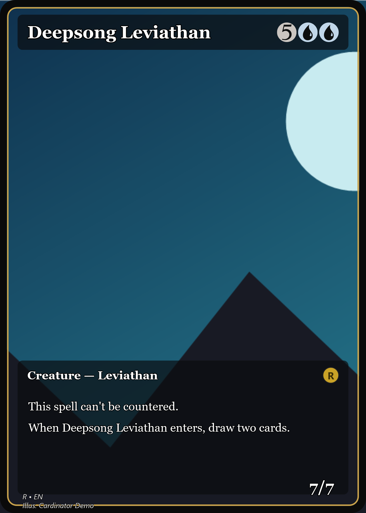

# Example 03 · Full-art cards (text on the artwork)

**When your art *is* the card.** The **Full Art** frame lets the artwork fill the whole card and
puts the text directly on top — kept readable by a subtle scrim and a white text shadow. Just set
`template` to `Full Art`.

## What's here

```
03-full-art/
  cards.csv          <- two cards using the Full Art frame
  art/               <- our placeholder artwork
  output/            <- the rendered result (checked in)
```

## The input — `cards.csv`

```csv
name,art,mana,type,rules,flavor,pt,template,rarity,artist
Nightfall Wanderer,art/wanderer.png,{2}{U}{R},Legendary Creature — Spirit Scout,"Flying, haste\n{T}: Add {U} or {R}.",She walks the ridge between dusk and dawn.,3/4,Full Art,M,Cardinator Demo
Deepsong Leviathan,art/leviathan.png,{5}{U}{U},Creature — Leviathan,"This spell can't be countered.\nWhen Deepsong Leviathan enters, draw two cards.",,7/7,Full Art,R,Cardinator Demo
```

## Run it

```powershell
Cardinator.exe --batch examples/03-full-art/cards.csv examples/03-full-art/output examples/03-full-art
```

## The output

<p>
  
  
</p>

Want to fine-tune the look? Full-art text uses light, shadowed fonts you can change per region
(size / color / shadow) in the template — see [docs/TEMPLATES.md](../../docs/TEMPLATES.md).
