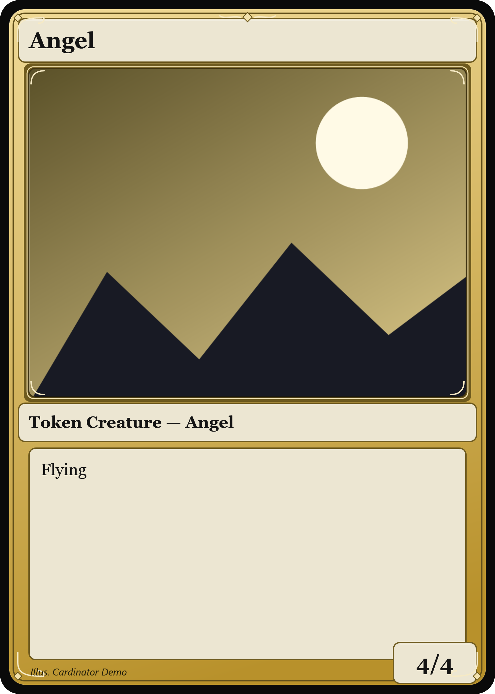
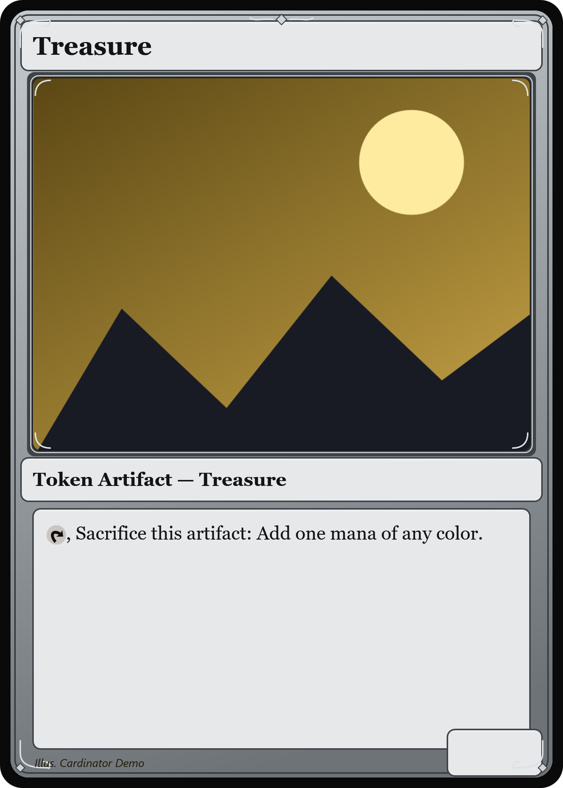
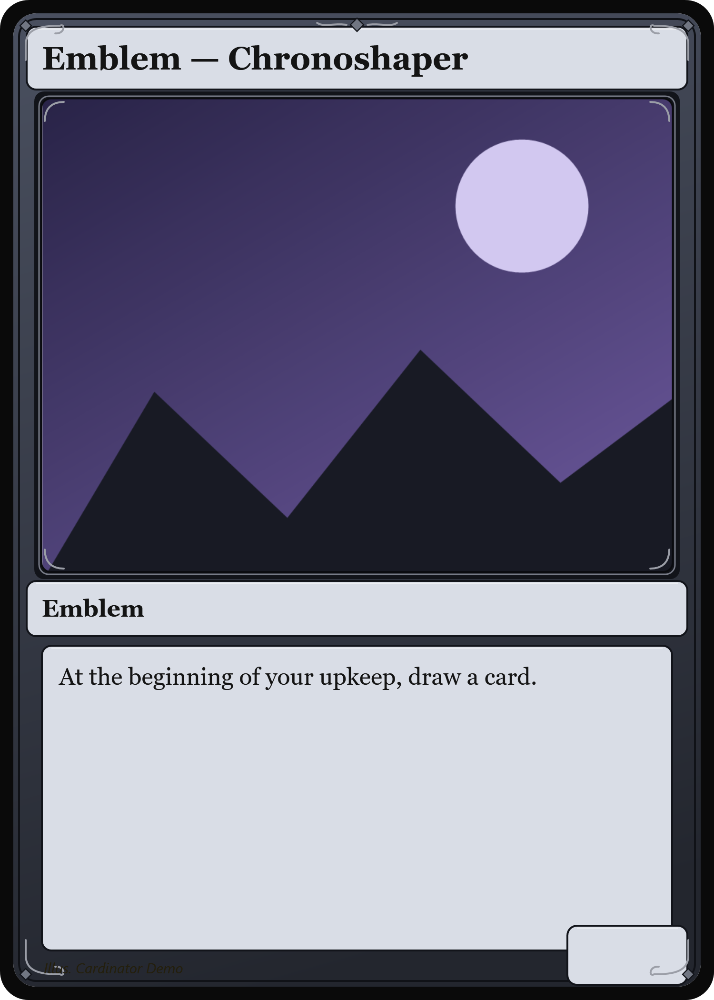

# Example 07 · Tokens & emblems

**The bits a deck needs besides the main cards.** Tokens and emblems are just cards with no mana
cost (and emblems have no power/toughness) — leave those cells blank and Cardinator lays them out
correctly.

## What's here

```
05-tokens-emblems/
  cards.csv          <- two creature tokens, a Treasure, and an emblem
  art/               <- our placeholder artwork
  output/            <- the rendered result (checked in)
```

## The input — `cards.csv`

Note the empty `mana` column throughout, and empty `pt` for the artifact/emblem.

```csv
name,art,mana,type,rules,pt,template,artist
Soldier,art/soldier.png,,Token Creature — Soldier,,1/1,Parchment,Cardinator Demo
Angel,art/angel.png,,Token Creature — Angel,Flying,4/4,Gold Multicolor,Cardinator Demo
Treasure,art/treasure.png,,Token Artifact — Treasure,"{T}, Sacrifice this artifact: Add one mana of any color.",,Slate Artifact,Cardinator Demo
Emblem — Chronoshaper,art/emblem.png,,Emblem,"At the beginning of your upkeep, draw a card.",,Midnight,Cardinator Demo
```

## Run it

```powershell
Cardinator.exe --batch examples/05-tokens-emblems/cards.csv examples/05-tokens-emblems/output examples/05-tokens-emblems
```

## The output

<p>
  
  
  
</p>
