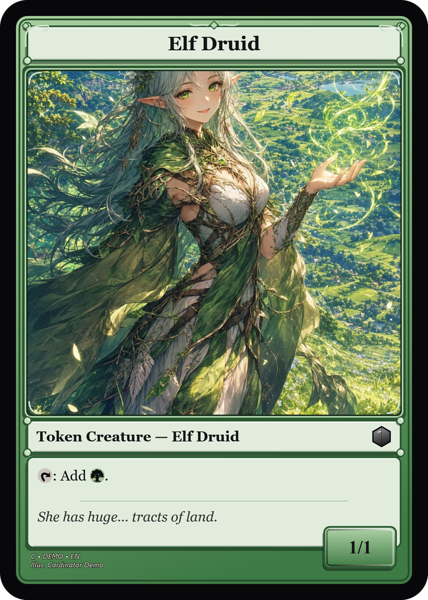
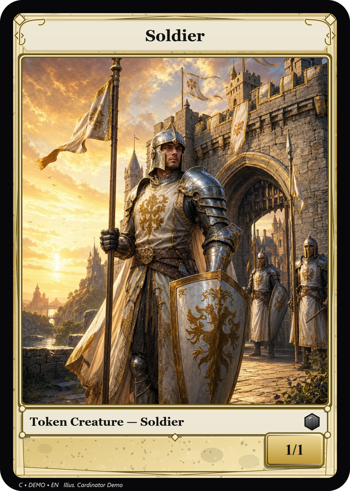
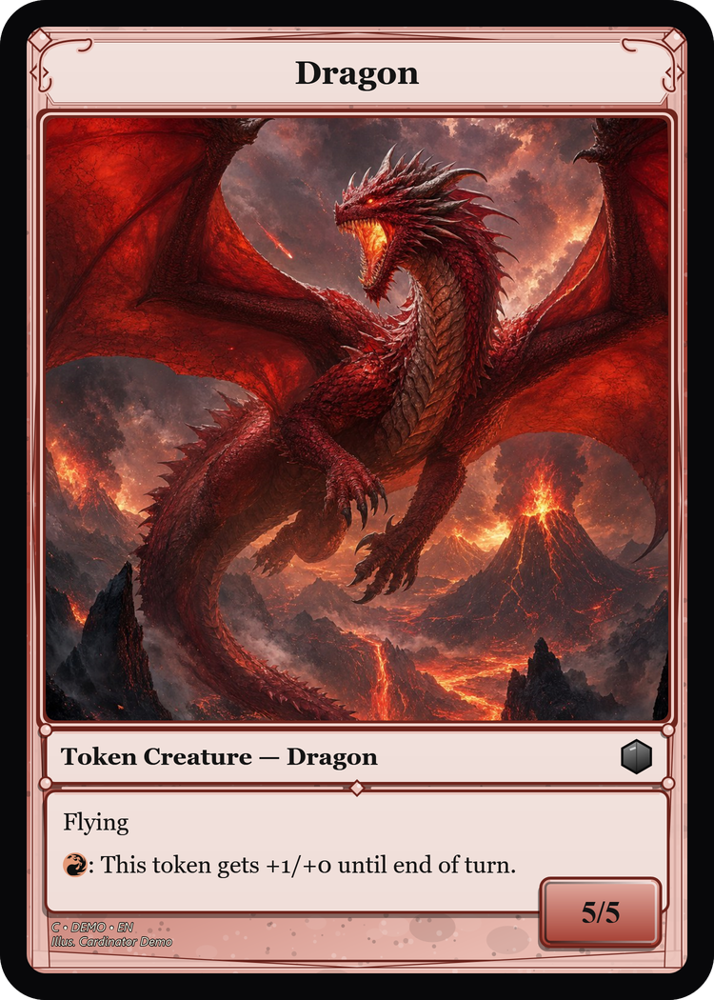
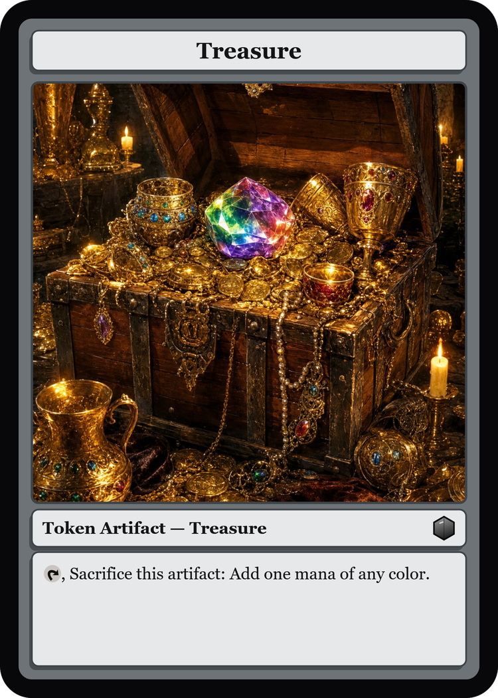
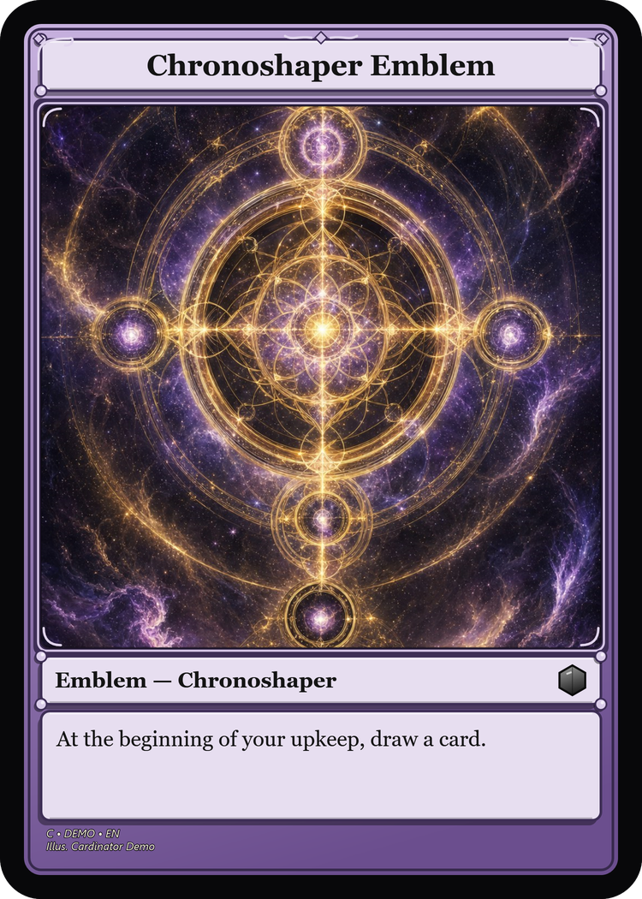
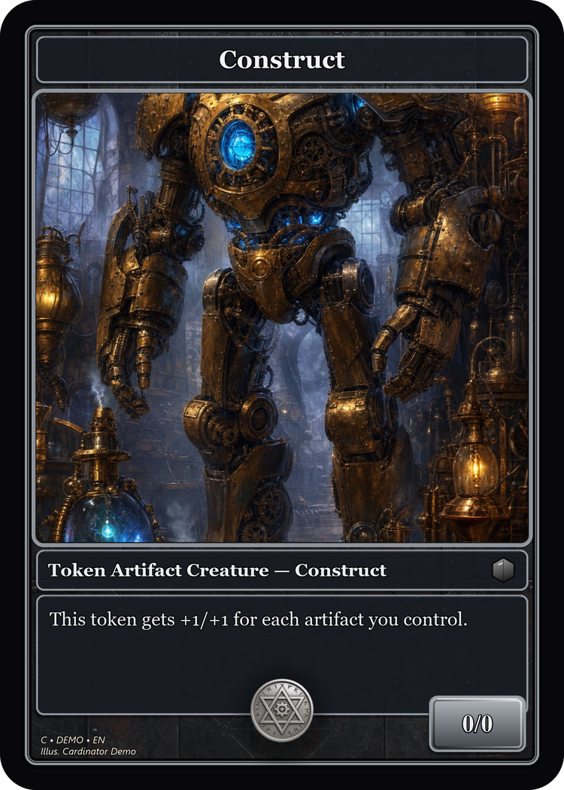
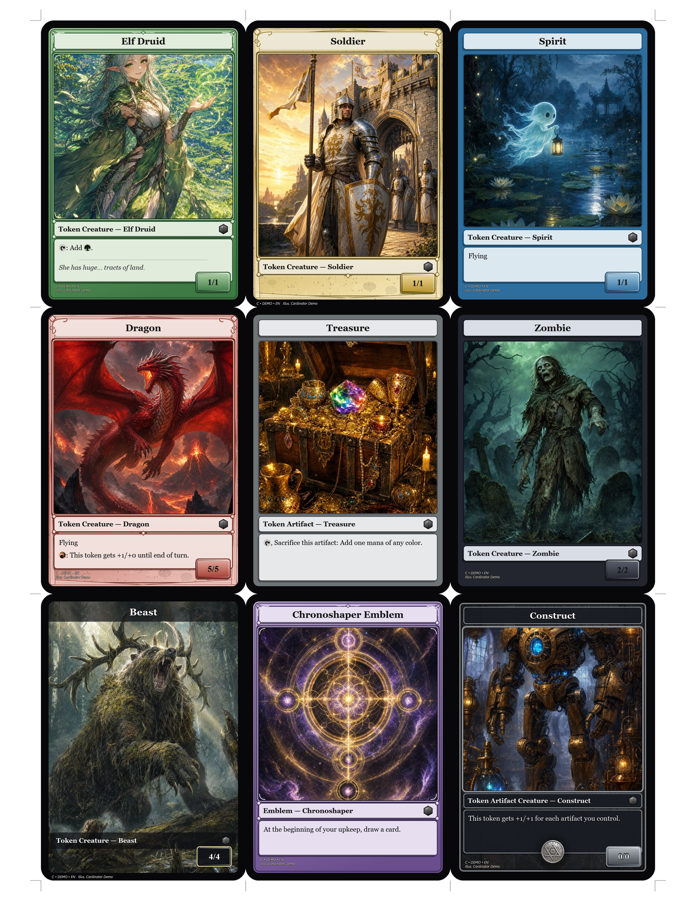

# Example 05 · Tokens & emblems

**The extras a set needs, made and printed with it.** A card whose type line starts with **Token** or
**Emblem** (the way Scryfall writes them: `Token Creature — Soldier`, `Emblem — Chronoshaper`) gets its
frame's **token layout**: the art runs much further down the card, the name is centred, and the text box is
just big enough for its rules — a **vanilla** token (no rules) has no text box at all. Leave the mana blank.

Nine tokens fill exactly one 3×3 print sheet, so a set's tokens print in one go.

## What's here

```
05-tokens-emblems/
  cards.csv          <- nine tokens and an emblem, across nine frames
  art/               <- our own artwork (generated for this example)
  output/            <- the rendered result + the print sheet (checked in)
```

## The input — `cards.csv`

Note the empty `mana` column throughout, and the empty `rules` on the vanilla tokens (Soldier, Zombie,
Beast): they get no text box. The emblem has no P/T. The Construct is on *Alchemist's Steel*, a picture
frame: picture frames get a token version too (their art window stretched, their own borders and medallion
kept), with a small text box even when vanilla, since the box is part of the picture.

```csv
name,art,mana,type,rules,flavor,pt,template,set,rarity,artist
Elf Druid,art/elf.jpg,,Token Creature — Elf Druid,{T}: Add {G}.,She has huge... tracts of land.,1/1,Forest Green,DEMO,C,Cardinator Demo
Soldier,art/soldier.jpg,,Token Creature — Soldier,,,1/1,Gold Multicolor,DEMO,C,Cardinator Demo
Spirit,art/spirit.jpg,,Token Creature — Spirit,Flying,,1/1,Ocean Blue,DEMO,C,Cardinator Demo
Dragon,art/dragon.jpg,,Token Creature — Dragon,Flying\n{R}: This token gets +1/+0 until end of turn.,,5/5,Crimson Red,DEMO,C,Cardinator Demo
Treasure,art/treasure.jpg,,Token Artifact — Treasure,"{T}, Sacrifice this artifact: Add one mana of any color.",,,Slate Artifact,DEMO,C,Cardinator Demo
Zombie,art/zombie.jpg,,Token Creature — Zombie,,,2/2,Midnight,DEMO,C,Cardinator Demo
Beast,art/beast.jpg,,Token Creature — Beast,,,4/4,Full Art,DEMO,C,Cardinator Demo
Chronoshaper Emblem,art/emblem.jpg,,Emblem — Chronoshaper,"At the beginning of your upkeep, draw a card.",,,Planeswalker,DEMO,C,Cardinator Demo
Construct,art/construct.jpg,,Token Artifact Creature — Construct,This token gets +1/+1 for each artifact you control.,,0/0,Alchemist's Steel,DEMO,C,Cardinator Demo
```

(The emblem belongs to *Chronoshaper, Timeless*, the planeswalker in [example 02](../02-custom-set/).)

## Run it

In the app: **Import list / CSV…** → `cards.csv`, then **Export all…** or **Print sheet…**. Or click
**Add token** to start one by hand. From the command line:

```powershell
Cardinator.exe --batch examples/05-tokens-emblems/cards.csv examples/05-tokens-emblems/output examples/05-tokens-emblems
Cardinator.exe --sheet examples/05-tokens-emblems/cards.csv examples/05-tokens-emblems/output examples/05-tokens-emblems
```

Real tokens work too: look one up (e.g. *Goblin // Soldier*), or **Import → Scryfall search** with `t:token`
(narrow it, e.g. `t:token t:spirit`).

## The output

<p>
  
  
  
</p>
<p>
  
  
  
</p>

**The print sheet** — all nine on one page:

<p></p>
