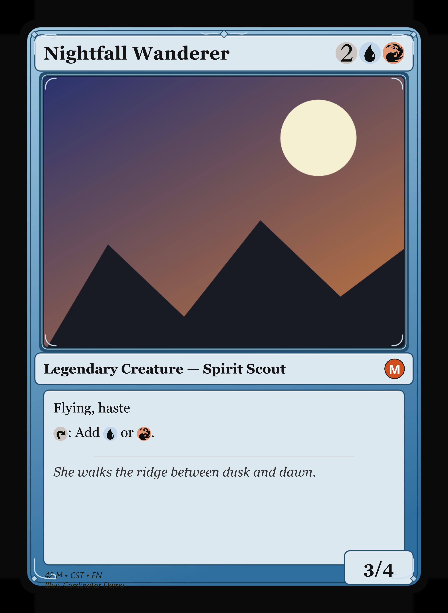

# Example 06 · Printing your cards

Two things you need when it's time to actually print: a **card back** for double-sided printing, and
a **print-ready export** (bleed margin + DPI) for print services like MakePlayingCards.

## What's here

```
06-printing/
  card.json               <- a single card, for the print-ready export
  art/hero.png            <- placeholder artwork
  output/card-back.png    <- the decorative card back (checked in)
  output/print-ready.jpg  <- exported with bleed + 300 DPI (checked in)
```

## Card back (double-sided printing)

Render a decorative back to print on the reverse of your sheets. The optional last argument is a
wordmark (your set's name).

```powershell
Cardinator.exe --cardback examples/06-printing/output/card-back.png "Aria's Deck"
```


To print double-sided: print a **fronts** sheet from another example (e.g.
`examples/01-real-cards-custom-art/output/sheet_page_01.png`), then print a page of these backs on
the reverse (9-up, duplex). Sheets are at true card size (2.5″ × 3.5″, 300 DPI), so print at 100%.

## Print-ready export (bleed + DPI)

For a print service that wants a bleed margin, a set DPI, and often JPEG:

```powershell
Cardinator.exe --render examples/06-printing/card.json examples/06-printing/output/print-ready.jpg scale=3 dpi=300 bleed=36 q=95
```

- `scale=3` supersample · `dpi=300` stamp · `bleed=36` edge-extended margin (×scale) · `q=95` JPEG quality
- A `.jpg` path writes JPEG; `.png` writes PNG.

The result is **2466 × 3366** with a filled bleed border around the card:



> Match `bleed` and `scale` to your print service's spec sheet. For a plain high-res PNG with no
> bleed, just `--render card.json out.png scale=3`.
